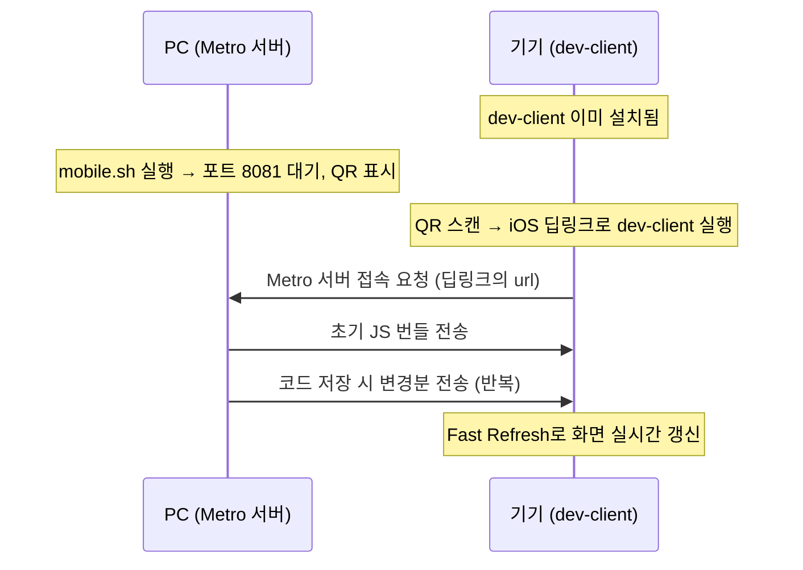

# Expo EAS 모바일 빌드·실행·제출 파이프라인

React Native(Expo) 앱을 "로컬에서 켜보는 것"과 "실기기에 설치하는 것"과 "스토어에 제출하는 것"은 전혀 다른 세 가지 파이프라인이다. 이름이 비슷한 명령어(`eas build`, `eas submit`)가 많아서 헷갈리기 쉬운데, 하나씩 원리를 뜯어보면 꽤 명확하게 나뉜다.

------------------------------------------------------------------------

# eas.json — 빌드/제출 프로필 구조

`eas.json`은 `build`와 `submit` 두 구획으로 나뉘고, 각 구획 안에 "프로필"이라는 이름으로 여러 설정 세트를 둔다. `eas build --profile <이름>`처럼 프로필 이름으로 어떤 설정을 쓸지 고른다.

```json
{
  "cli": { "appVersionSource": "local" },
  "build": {
    "development": {
      "developmentClient": true,
      "distribution": "internal",
      "ios": { "simulator": false }
    },
    "preview": { "distribution": "internal" },
    "production": { "environment": "production", "autoIncrement": true }
  },
  "submit": {
    "production": { "ios": { "ascAppId": "..." } }
  }
}
```

| 프로필 | 목적 | 배포 방식 |
|---|---|---|
| `development` | 개발자용 dev-client 생성 | ad-hoc, 특정 기기에 직접 설치 |
| `preview` | 팀 내부 확인용 빌드 | ad-hoc, EAS 링크로 직접 설치 |
| `production` | 스토어 릴리스용 빌드 | store 서명, App Store Connect 업로드 |

`cli.appVersionSource: "local"`은 버전/빌드번호의 기준을 EAS 클라우드가 아니라 로컬 `app.json`으로 삼겠다는 뜻이다. `autoIncrement: true`와 맞물려서, 빌드할 때마다 EAS가 buildNumber를 올린 결과를 로컬 `app.json`에 다시 써준다.

------------------------------------------------------------------------

# dev-client란 무엇인가

앱스토어의 "Expo Go"는 Expo가 미리 만들어둔 범용 뷰어 앱이다. 문제는 프로젝트가 커스텀 네이티브 설정(예: WebView의 ATS 예외, 위치 권한 등)을 쓰면 Expo Go로는 제대로 안 열린다 — Expo Go는 자기 자신의 Info.plist를 쓰기 때문이다.

**dev-client**는 이 문제를 풀기 위한 "이 프로젝트 전용으로 만든 Expo Go"다.

```bash
eas build --profile development --platform ios
```

- 실제 컴파일은 로컬이 아니라 **EAS 클라우드 서버**에서 일어난다. 로컬 터미널은 요청만 보내고 결과를 기다린다.
- 완성되면 **OTA(무선) 설치 링크/QR**이 나온다. 이 링크를 실기기(맥이 아니라 폰!)에서 직접 열면, 폰이 EAS 서버에서 `.ipa`를 다운로드해서 설치한다. USB 케이블도 Xcode도 필요 없다.
- `distribution: internal` + `ios.simulator: false` 조합이라 **ad-hoc 서명**이다. 미리 `eas device:create`로 등록해둔 UDID를 가진 기기에서만 설치가 허용된다.
- 네이티브 모듈이 안 바뀌는 한 다시 빌드할 필요 없다 — 이게 "한 번 설치하고 오래 쓰는" 이유다.

------------------------------------------------------------------------

# Metro 서버와 ./mobile.sh

**Metro**는 React Native 진영의 JS 번들러 겸 개발 서버다. TypeScript/JSX 소스를 JS로 변환해서 네트워크로 서빙하고, 파일이 바뀌면 바뀐 부분만 다시 컴파일해서 WebSocket으로 실시간 전송한다(Fast Refresh의 엔진).

`./scripts/mobile.sh`가 실제로 하는 일은 세 가지뿐이다:

```bash
# 1. .env 존재 확인
# 2. 로컬 WiFi IP 감지 → EXPO_PUBLIC_API_BASE_URL 자동 갱신
LOCAL_IP="$(ipconfig getifaddr en0 2>/dev/null || ipconfig getifaddr en1 2>/dev/null || true)"
sed -i '' "s|^EXPO_PUBLIC_API_BASE_URL=.*|EXPO_PUBLIC_API_BASE_URL=http://${LOCAL_IP}:8080|" .env
# 3. Metro 실행
npx expo start
```

2번이 있는 이유: 실기기가 같은 WiFi 안에서 개발자 컴퓨터의 로컬 백엔드에 접근하려면, 그날그날 바뀌는 IP를 매번 손으로 맞출 필요가 없게 하기 위해서다.

**dev-client = 브라우저, Metro = 웹사이트를 서빙하는 서버**라고 생각하면 관계가 명확해진다. 브라우저는 한 번 설치하면 오래 쓰고, 웹사이트 내용(JS)만 서버에서 계속 새로 받아온다. 네이티브 모듈을 추가했는데 `mobile.sh`만 다시 켜면 "Native module OOO not found" 같은 런타임 에러가 나는데, 이건 Metro가 JS는 보냈지만 그 JS가 호출하는 네이티브 코드가 폰에 물리적으로 없어서다 — 이럴 때만 dev-client를 다시 빌드한다.

------------------------------------------------------------------------

# dev-client는 Metro를 어떻게 "찾아서" 붙는가

방향이 헷갈리기 쉬운데, **Metro가 폰을 찾는 게 아니라 dev-client가 Metro를 찾아간다.**

핵심은 `app.json`의 `"scheme": "runvas"`다. dev-client를 빌드할 때 이 값이 iOS에 **커스텀 URL 스킴**으로 등록된다. `mobile.sh`가 출력하는 QR은 이런 딥링크를 인코딩한 것이다:

```
exp+runvas://expo-development-client/?url=http://192.168.x.x:8081
```

QR을 스캔하면:
1. iOS가 `exp+runvas://` 스킴을 등록한 앱(=dev-client)을 찾아서 **직접 실행**시킨다 (카카오톡 링크 누르면 카카오톡이 열리는 것과 같은 원리).
2. dev-client가 링크의 `url` 파라미터를 읽어서 Metro 서버 주소를 알아낸다.
3. dev-client가 그 주소로 HTTP/WebSocket 접속을 건다.



즉 QR = "이 주소로 접속해"라는 쪽지, iOS의 URL 스킴 = 그 쪽지를 정확히 dev-client 손에 쥐여주는 배달 시스템, dev-client = 쪽지를 읽고 스스로 전화를 거는 쪽이다.

------------------------------------------------------------------------

# eas build vs eas submit

이름이 비슷해서 헷갈리지만 하는 일이 완전히 다르다.

| | `eas build` | `eas submit` |
|---|---|---|
| 하는 일 | 소스코드를 **컴파일**해서 새 바이너리를 만듦 | 이미 만들어진 바이너리를 App Store Connect에 **업로드**만 함 |
| 입력 | 프로젝트 소스코드 전체 | 완성된 빌드 (build ID로 지정) |
| 새로 컴파일? | 함 | 안 함 |
| 목적 | 개발/배포용 앱 생성 | 스토어 심사 큐에 올리기 위한 준비 |

`eas submit --profile production`이 하는 건 **바이너리 업로드까지만**이다. 실제 "심사 제출"(App Store Connect에서 빌드 선택 → 데모 계정 입력 → 심사 제출 버튼)은 여전히 사람이 App Store Connect UI에서 직접 눌러야 하는 별도 단계다.

------------------------------------------------------------------------

# eas submit은 어떤 빌드를 제출하는가 — 프로필로 안 걸러지는 함정

`eas-cli` 소스코드(`submit/ArchiveSource.js`)를 직접 까보면:

- `--id`/`--latest`/`--path`/`--url` 중 아무것도 안 주면, 비대화형(`--non-interactive`)에선 즉시 에러, 대화형이면 최근 빌드 **4개**를 보여주는 프롬프트가 뜬다.
- 이 목록은 **플랫폼(iOS/Android)과 프로젝트로만 필터링**되고, **어떤 프로필로 빌드됐는지는 전혀 구분하지 않는다.** `--profile production`은 제출 시 인증/설정값을 정할 때만 쓰이지, "production 프로필 빌드만 보여줘"라는 필터가 아니다.
- `--latest`도 마찬가지다 — 이 플랫폼에서 가장 최근에 만들어진 빌드 1개를 가져올 뿐, `development`/`preview` 빌드가 더 최근이면 그게 뽑힌다.

그래서 **모호함을 없애려면 `--id`로 정확한 빌드 ID를 직접 지정하는 게 안전하다**:

```bash
eas build:list --platform ios --limit 3   # 먼저 정확한 빌드 ID 확인
eas submit --platform ios --id <buildId>
```

------------------------------------------------------------------------

# App Store Connect API 키 인증

`eas submit`이 App Store Connect에 인증하는 방법은 우선순위 순으로 세 가지다 (`eas-cli`의 `resolveCredentials.js` 기준):

1. **`eas.json`에 직접 값 기재** (`ascApiKeyPath`/`ascApiKeyId`/`ascApiKeyIssuerId`) — 값이 있으면 최우선
2. **환경변수** — `EXPO_ASC_API_KEY_PATH`, `EXPO_ASC_KEY_ID`, `EXPO_ASC_ISSUER_ID` (`eas-cli`가 공식 지원)
3. **EAS 서버에 저장된 관리형 키** — 과거에 대화형으로 `eas submit`을 실행하며 EAS가 자동 생성해 서버에 보관해둔 키가 있으면 이게 최종 fallback

API 키는 세 요소로 구성된다:

| 요소 | 성격 |
|---|---|
| Issuer ID | 팀(계정)을 식별하는 UUID, 고정값 |
| Key ID | 키 자체를 식별, 키를 새로 만들면 바뀜 |
| `.p8` 파일 | 실제 비밀 키, **생성 시 1회만 다운로드 가능** — 놓치면 그 키는 폐기하고 새로 만들어야 함 |

App Store Connect의 API 키 화면은 **Team Keys**(조직 공용, 여기서 만들어야 함)와 **Individual Keys**(개인용, `eas submit`엔 안 씀) 두 탭으로 나뉘어 있어서 헷갈리기 쉽다.

참고로 `ascAppId`(App Store Connect에 등록된 앱 자체의 숫자 ID, Bundle ID와는 다른 값)는 위 인증과 무관하게 별도로 필요하다 — 있으면 "이 앱이 맞는지 조회"하는 단계에서 Apple ID 로그인을 요구하지 않고 넘어간다. 앱이 존재하는 한 영구 고정값이다.

------------------------------------------------------------------------

# 로컬 시크릿 관리 vs GitHub Secrets

`.p8` 키를 어디에 두느냐에 따라 자동화 정도가 달라진다.

| | 로컬 스크립트 (`.env` 방식) | GitHub Secrets |
|---|---|---|
| 저장 위치 | 개발자 컴퓨터 (git 밖, gitignore 대상 폴더) | GitHub 서버 (암호화, 커밋 파일엔 이름만 노출) |
| 실행 주체 | 사람이 직접 터미널에서 | GitHub Actions가 자동으로 |
| 필요 조건 | 매번 본인이 명령어 입력 | 태그 push만 하면 끝 |
| 사람의 최종 검토 | 있음 | 없음 (CI가 그대로 밀어붙임) |

리젝 이력이 있는 앱처럼 제출 전에 실기기 확인이 중요한 상황에서는, 자동 제출보다 **사람이 마지막에 확인하고 누르는 로컬 방식**이 더 안전하다. 자동화의 이득도 생각보다 크지 않다 — 애초에 `eas submit`은 바이너리 업로드까지만 하고, 실제 심사 제출(데모 계정 입력 등)은 어차피 App Store Connect에서 수동으로 해야 하기 때문이다.

------------------------------------------------------------------------

# GitHub Actions CI/CD 트리거 구조

| 워크플로 | 트리거 | 비고 |
|---|---|---|
| `*-eas-build-production.yml` | `mobile-v*.*.*` 태그 push | 빌드까지만 자동, `eas submit`은 없음 |
| `*-deploy.yml` (백엔드) | `backend-v*.*.*` 태그 push | Docker 이미지 빌드 + 운영 서버 배포까지 자동 |
| `*-typecheck.yml` / `*-test.yml` | PR + main push (경로 필터) | 머지 전 검증 게이트 |
| `commit-message.yml` | PR 생성/수정 | 커밋 규칙 검증, 경로 필터 없음 |
| `*-eas-build-preview.yml` | `workflow_dispatch` (수동) | 자동 트리거 전혀 없음, EAS 크레딧 아끼려고 의도적으로 수동 |

태그 prefix(`mobile-v*` vs `backend-v*`)가 서로 겹치지 않아서, 태그 하나를 push해도 의도한 워크플로 하나만 정확히 트리거된다. `branches: [main, master]` 필터를 쓰는 워크플로는 태그 push(`refs/tags/...`)엔 반응하지 않는다 — 브랜치 push와 태그 push는 git 레퍼런스 상에서 완전히 다른 네임스페이스이기 때문이다.

------------------------------------------------------------------------

# 한 줄 정리

> **`eas build`는 컴파일해서 새 바이너리를 만드는 것, `eas submit`은 이미 만든 바이너리를 업로드만 하는 것이다. dev-client는 네이티브 코드를 담은 "한 번 설치하는 그릇"이고, Metro(`mobile.sh`)는 그 그릇에 JS를 계속 채워 넣는 쪽이며, 이 둘은 QR에 담긴 딥링크와 iOS의 URL 스킴 라우팅으로 연결된다. 스토어 제출 자동화는 `--id`로 빌드를 명확히 지정하지 않으면 프로필로도 안 걸러지는 함정이 있어서, 사람이 마지막에 확인하는 단계를 의도적으로 남겨두는 게 안전하다.**
