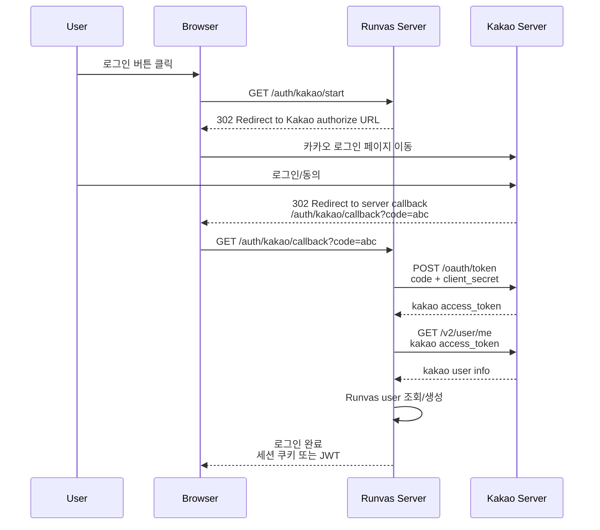
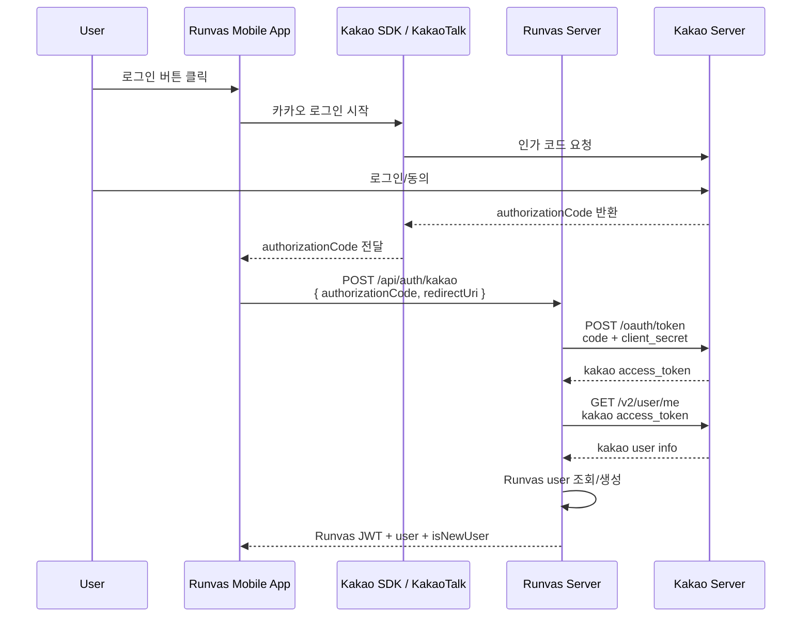

**웹: 서버가 Code를 받음**


웹에서는 브라우저가 페이지 이동을 계속 따라갑니다. 그래서 카카오의 redirect_uri가 보통 서버 주소입니다.
```
https://api.runvas.com/auth/kakao/callback
```

**앱: 앱이 Code를 받은 뒤 서버에 전달**


앱에서는 카카오 로그인 후 다시 앱으로 돌아와야 합니다. 그래서 redirect_uri가 앱 딥링크일 수 있어요.
```
runvas://auth/kakao
```

한 문장으로 정리하면:
```
웹은 카카오가 code를 서버 callback URL로 보낸다.
앱은 카카오 SDK가 code를 앱에 주고, 앱이 그 code를 서버에 보낸다.
```
Runvas 모바일 앱은 두 번째 흐름이 더 자연스럽습니다. 서버는 여전히 중요한 일을 합니다: client_secret 보관, 카카오 토큰 교환, 카카오 사용자 조회, Runvas JWT 발급. 앱은 카카오 로그인 UI를 시작하고 authorizationCode를 서버에 전달하는 역할만 맡습니다.