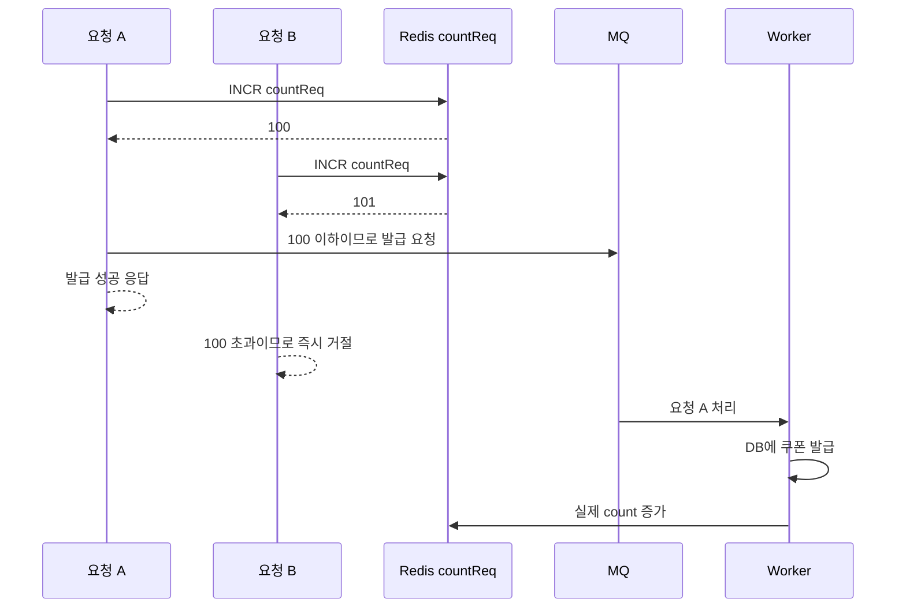

참고:
https://oliveyoung.tech/2025-12-15/fcfs-coupon/

핵심부터 말하면, 이중 카운터는 **“발급 자리를 예약한 요청 수”와 “실제로 발급 완료된 수”를 분리해서 관리하는 방식**입니다.

- `countReq`: 발급 자리를 확보한 요청 수
- `count`: 실제 쿠폰 발급 수

이를 통해 사용자가 성공 응답을 받은 뒤 워커에서 “수량이 이미 끝났다”며 실패하는 일을 막았습니다.



## 이중 카운터란?
쉽게 비유하면 다음과 같습니다.

- `countReq`: 공연장의 입장권 번호표
- `count`: 실제로 공연장에 입장한 사람 수

번호표를 100번까지만 나눠주면 101번째 사람은 입구에서 바로 거절할 수 있습니다. 이미 번호표를 받은 사람은 내부에서 “자리가 없다”며 거절당하지 않습니다.

### countReq가 동시 요청을 막는 방법
쿠폰 100개 중 `countReq = 99`인 상황에서 요청 A와 B가 동시에 들어왔다고 가정하겠습니다.
```text
요청 A: INCR countReq → 반환값 100 → 허용
요청 B: INCR countReq → 반환값 101 → 거절
```

## 주의
이중 카운터가 모든 종류의 발급 실패를 마법처럼 제거한 것은 아닙니다. 게시글에서 해결한 핵심 문제는 다음 실패입니다.

> 동시 요청이 제한 수량보다 많이 앞단 검사를 통과해, 성공 응답 후 워커의 수량 검사에서 실패하는 문제

DB 장애나 워커 오류 같은 별도의 실패 가능성은 여전히 존재할 수 있습니다. 이런 경우에는 게시글에서 언급한 것처럼 다음 장치가 추가로 필요합니다.

- 선점한 `countReq` 복구
- 메시지 재시도
- `countReq`와 `count` 차이 모니터링
- 불일치 발생 시 자동 또는 수동 보정
- Redis 장애 시 DB 기반 fallback

이중 카운터의 핵심은 **“실제 발급 전에 수량을 예약해 초과 요청을 차단하고, 예약 수와 완료 수를 따로 추적하는 것”**

---
