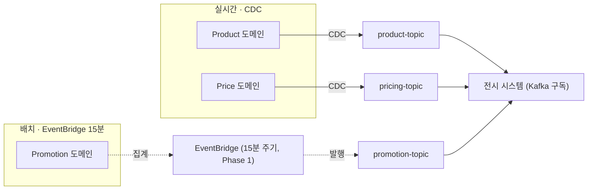
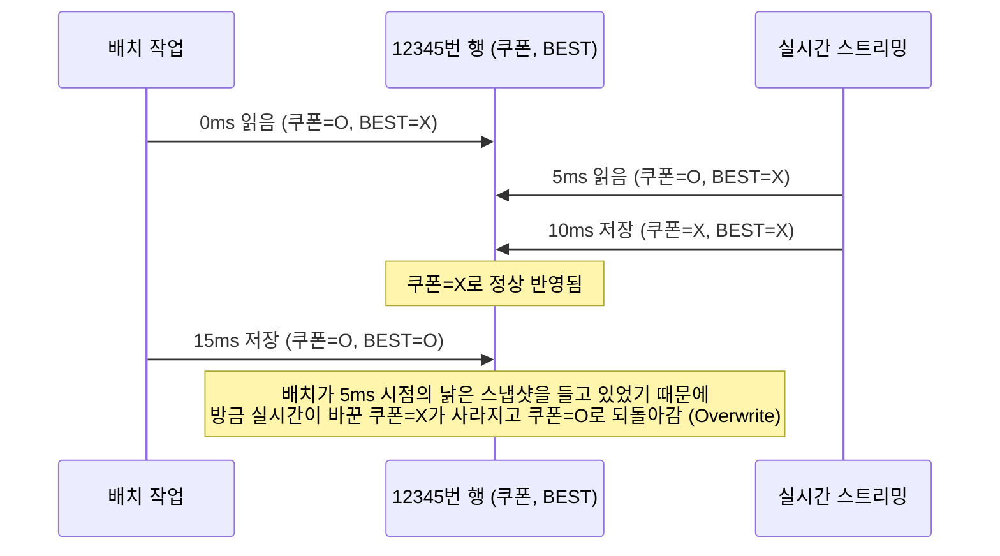
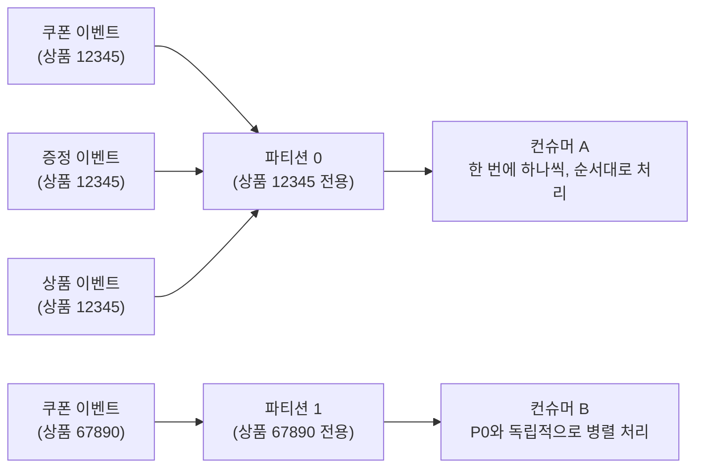
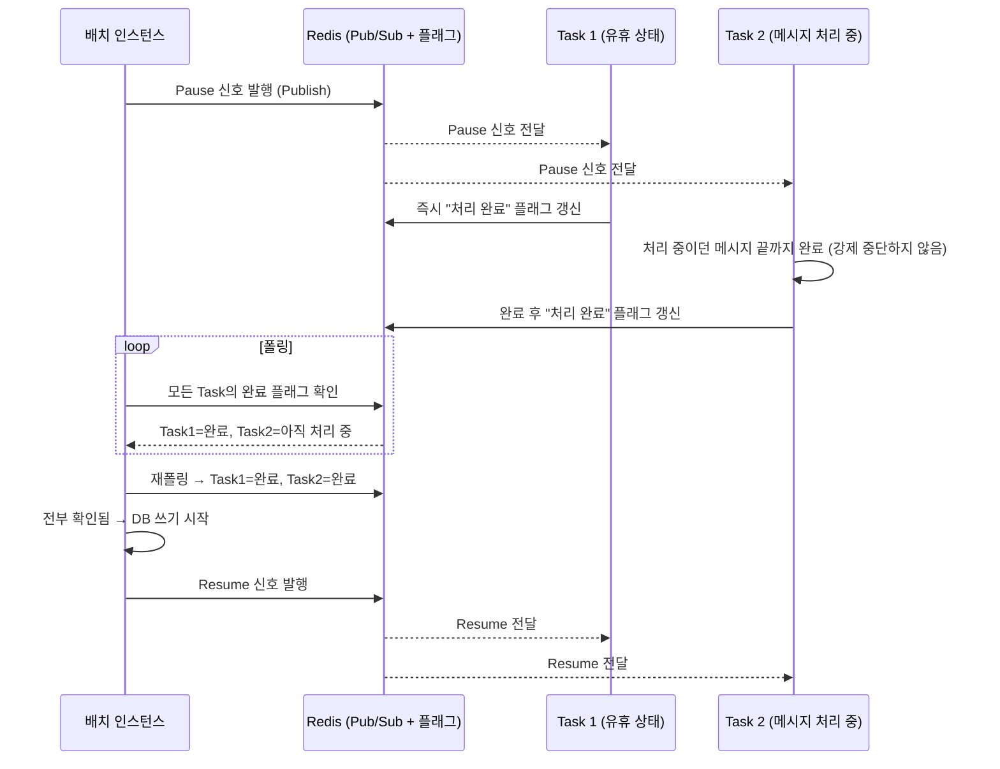
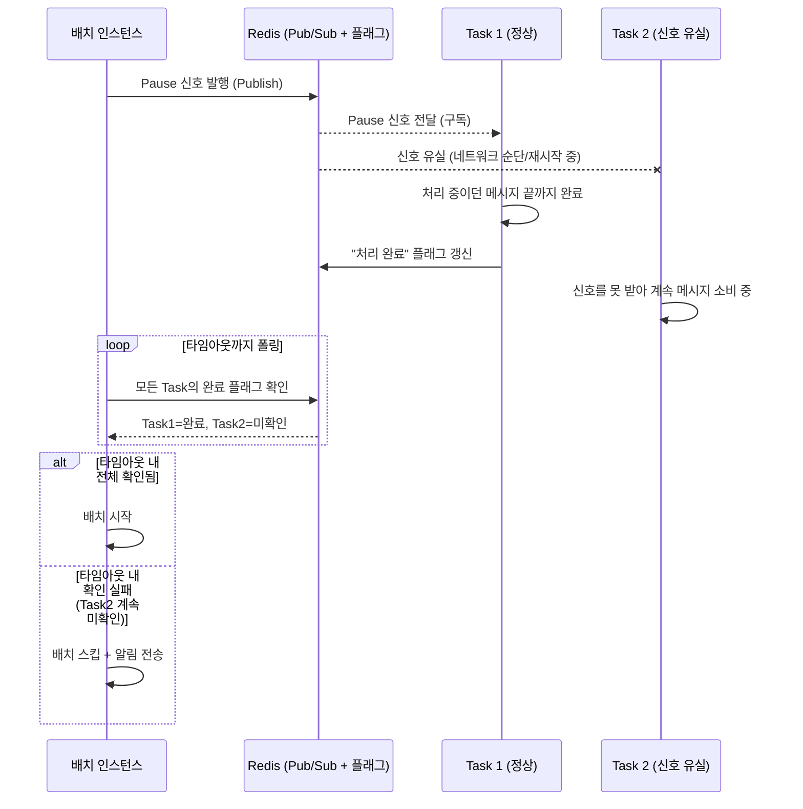

참고:
https://oliveyoung.tech/2026-04-22/display-benefits-migration/

상품카드에 상품·쿠폰·증정·프로모션 혜택을 통합해 보여주던 단일 프로시저 배치를, 왜 그리고 어떻게 Kafka 이벤트 기반 구조로 바꿨는지 정리. "일부는 실시간, 일부는 배치"로 나눈 이유가 특히 면접에서 나올 법한 판단 포인트라 자세히 남긴다.

## 문제였던 것: 10년 묵은 단일 프로시저

상품·쿠폰·증정·프로모션 로직이 하나의 거대한 DB 프로시저 안에 "불투명하게 결합"돼 있었다. 여기서 불투명하다는 건 코드를 봐도 "이 조건을 바꾸면 어디까지 영향이 가는지" 파악이 안 된다는 뜻이다. 10년간 계속 로직이 끼워 넣어지다 보니, 쿠폰 조건 하나 고쳤는데 증정 계산 흐름이 꼬여버리는 식의 문제가 생겼다.

이게 만든 3단 콤보:
1. **강결합**: 특정 조건 하나를 바꾸면 전체 로직에 영향을 줌
2. **테스트 불가**: 프로시저 전체가 한 덩어리라 "쿠폰 계산 부분만" 떼어서 유닛테스트를 돌릴 수가 없음 → 조건 하나 바꿀 때마다 전체 케이스를 수동으로 다 확인해야 해서 검증 비용이 큼
3. **운영 리스크**: 프로시저는 전시팀이 관리하는데, 정작 쿠폰/프로모션 세부 정책은 각 도메인팀이 더 잘 앎. 전문성 없는 팀이 남의 로직이 섞인 코드를 고쳐야 하니 단순한 정책 변경도 위험해짐

성능 문제도 있었다: 이 프로시저는 **변경된 데이터가 1건이든 0건이든 매번 전체를 재계산**했다. 상품 하나만 바뀌어도 수만~수십만 건을 다시 훑으면서 불필요한 I/O와 Redo log가 대량 발생 → 최대 45분 지연.

## 왜 이번이 더 어려웠나: 단일 도메인이 아니라 다중 도메인

올리브영에는 이미 배치 → 이벤트 기반 전환 사례가 있었다 (품절 시스템, 캠페인 시스템 등). 하지만 그건 전부 **도메인 하나**만 실시간으로 바꾸면 되는 문제였다.

이번엔 상품카드 하나에 상품·쿠폰·증정·프로모션이라는 서로 다른 도메인 여러 개를 동시에 합쳐야 했다. 그러다 보니:
- 도메인마다 데이터 생명주기가 다름 (상품 Row가 먼저 있어야 쿠폰이 의미를 가짐 → 순서 의존성)
- 도메인마다 제공 방식이 다름 (실시간이 가능한 도메인도, 아직 안 되는 도메인도 있음)

즉 "강 하나 건너면 끝"이 아니라 "서로 다른 강 여러 개를 순서 맞춰가며 동시에 건너야 하는" 문제였다.

## "전부 실시간으로" 가 아니라 데이터 특성별로 나눈 이유

처음엔 "프로시저 걷어내고 다 이벤트 기반으로 바꾸면 되지 않나?"라고 생각했지만, 실제로는 데이터마다 요구되는 실시간성이 달랐다.

**왜 전부 실시간으로 밀어붙이면 안 되나:**
- 실시간 이벤트를 쏘려면 그 도메인팀이 자기 시스템에 "데이터 바뀔 때마다 Kafka producer 호출" 코드를 새로 심어야 함 — 공짜 작업이 아니고, 모든 도메인팀이 프로젝트 일정 안에 동시에 끝낼 수 없음
- 어떤 데이터는 애초에 "바뀌는 시점"이 명확한 이벤트가 아님. 예를 들어 **BEST(베스트 상품)**는 하루 단위로 집계되는 값이라, 실시간으로 계산해봐야 하루가 끝나야 순위가 확정되므로 실시간 전환의 실효성 자체가 낮음 (기술 문제가 아니라 데이터 성격 문제)

그래서 "각 데이터가 어느 정도의 실시간성을 요구하는지 판단하는 과정"이 먼저 필요했고, 이게 "코드가 아니라 도메인 간 데이터 흐름과 책임의 재정의"라는 표현으로 이어진다.

**책임의 재정의란:**
- 기존: 전시 시스템이 프로시저로 각 도메인 테이블을 직접 조회하러 감 (Pull, 전시팀이 다 떠안는 구조)
- 신규: 각 도메인팀이 "내 데이터 바뀌면 내가 직접 Kafka로 발행한다"는 책임을 짐 (Push, 책임이 도메인팀으로 분산)

## 실제 아키텍처: 하이브리드 (CDC 실시간 vs EventBridge 배치)



플래그 기준으로 보면:
| 처리 방식 | 해당 플래그 | 이유 |
|---|---|---|
| 이벤트 기반 (CDC, 준실시간) | 오늘드림, 신상, 쿠폰(A타입) | 소스 시스템이 이미 실시간 발행 가능 |
| 배치 기반 (EventBridge 15분) | GIFT, SALE, N+1, 쿠폰(B타입) | 도메인팀 이벤트 발행 체계가 아직 준비 안 됨 (협의 필요 상태) |
| 배치 기반 (EventBridge 15분) | BEST (일간 기준 집계) | 애초에 일 단위로 확정되는 값이라 실시간 전환 자체의 효용이 낮음 |

같은 "배치"로 묶여 있어도 이유가 다르다는 게 포인트: GIFT/SALE/N+1/쿠폰은 "아직 기술적으로 준비가 안 된 케이스", BEST는 "준비가 되어도 실시간으로 바꿀 이유가 없는 케이스"다.

EventBridge는 AWS의 크론(cron) 같은 스케줄러로, 15분마다 트리거를 쏴서 "그동안 바뀐 Promotion 데이터를 확인해 Kafka로 발행"하는 배치 작업을 자동 실행시켜주는 역할을 한다. 다만 이 15분 배치도 "특정 시점에 일괄 계산된 결과를 조회하는" 예전 방식이 아니라, Kafka topic으로 흘러들어가는 지속적인 데이터 흐름의 일부로 편입됐다는 점이 예전 프로시저 방식과의 근본적 차이다.

## 개선 구조에서 전시 시스템이 실제로 하는 일

기존엔 전시 시스템이 수동적이었다 — 정해진 시각에 프로시저가 돌면서 모든 도메인 테이블을 직접 조회해 전체를 재계산하고 결과 테이블에 통째로 덮어썼다.

개선 후엔 전시 시스템 자체가 **Kafka를 계속 구독하고 있는 상시 실행 프로그램(ECS Task)**이 됐다. 메시지가 도착하면 "전체 재계산"이 아니라, 그 메시지가 가리키는 **상품 한 개의 행(row)만 찾아서 UPSERT**한다.

이게 가능한 이유는 상품별 혜택 정보가 **하나의 테이블, 한 행에 여러 도메인 값이 컬럼으로 다 모여있는 구조**이기 때문이다.

```
상품ID: 12345  (전시혜택테이블의 한 행)
├─ 쿠폰여부: O   ← 실시간 스트리밍(CDC)이 갱신
├─ 증정여부: X   ← 배치(EventBridge)가 갱신
├─ BEST여부: O   ← 배치(EventBridge)가 갱신
└─ 신상여부: O   ← 실시간 스트리밍(CDC)이 갱신
```

만약 상품 데이터가 여러 테이블에 흩어져 있었다면, 쿠폰 메시지 하나만 와도 "이 상품 정보를 온전히 보여주려면 결국 관련된 걸 다 다시 모아야" 했을 것이다. "한 행에 다 몰아놓은 구조" 덕분에 이벤트가 와도 **그 행의 해당 컬럼만 딱 고치면 끝**나는, 진짜 부분 갱신이 가능해졌다.

## 배치-스트리밍 간 동시성 제어와 Aggregation Topic

이 구간에서는 서로 다른 원인에서 출발한 두 문제가 나온다 — ① 배치와 스트리밍이 같은 행을 동시에 써서 생기는 **덮어쓰기(Overwrite)** 문제, ② 도메인끼리 처리 순서가 안 맞아서 생기는 **순서 의존성(적재 실패)** 문제. 결론부터 말하면 이 둘은 **같은 해법(Aggregation Topic + 상품ID 파티셔닝)**으로 함께 풀린다.

**먼저 ① 덮어쓰기 문제부터**: 도메인(쿠폰팀, 프로모션팀 등)은 서로 다른 값을 쓰지만, **쓰는 대상(같은 상품의 같은 행)은 겹친다.** 보통 "행 전체를 읽고 → 필요한 컬럼만 고쳐서 → 행 전체를 다시 저장"하는 read-modify-write 패턴을 쓰는데, 이 타이밍이 겹치면 사고가 난다.



즉 컬럼은 달라도 그 컬럼들이 물리적으로 같은 행 안에 있어서, 그 행을 다루는 두 작업이 겹치면 한쪽이 다른 쪽의 최신 변경을 덮어쓸 수 있다. 이게 테이블 락, 업데이트 경합, 데이터 덮어쓰기 문제로 이어졌다.

**그다음 ② 순서 의존성 문제 — Aggregation Topic이 애초에 왜 필요했나**

상품카드엔 "대표 옵션"이 노출되는데, 이 대표 옵션은 수시로 바뀔 수 있다. 쿠폰/증정 행사는 이 **옵션 단위**로 적용되고, BEST(베스트 상품 여부)는 **상품 단위**로 적용된다. 문제는 각 도메인이 서로 다른 토픽에 독립적으로 발행하다 보니, 토픽 간 메시지 도착·처리 순서를 보장할 방법이 없었다는 것.

핵심 의존성: **쿠폰·증정 데이터는 "연결할 상품 Row가 이미 존재해야만" 적재할 수 있다.** 즉 상품 데이터가 먼저 처리돼 있어야, 그 뒤에 쿠폰 데이터가 그 상품에 붙을 수 있다.

**구체적으로 뭐가 문제였나**
```
동시에 발생: 신규 상품 등록 + 그 상품의 쿠폰 정보 변경
→ 각자 다른 토픽에서 독립적으로, 병렬로 처리됨

[문제 되는 순서]
쿠폰 메시지가 먼저 처리됨 → 아직 상품 Row가 없음
→ "이 쿠폰, 어느 상품 거야?" 연결할 대상이 없어 적재 실패
```
단순히 토픽을 도메인별로 나눠놓은 것만으로는 이 순서를 제어할 수 없었다 (각 토픽은 서로의 존재를 모르고 병렬로 흘러가니까). 그래서 각 토픽 메시지를 곧바로 처리하지 않고 **하나의 Aggregation Topic으로 모아 처리 순서를 조율**하는 구조를 도입했다.

**왜 하필 "상품ID"를 공통 파티셔닝 키로 썼나**

보통은 토픽마다 자기 도메인의 자연스러운 ID로 파티셔닝한다 (쿠폰 토픽 → 쿠폰ID, 상품 토픽 → 상품ID처럼). 하지만 이렇게 도메인마다 따로 파티셔닝하면, 서로 다른 파티션에 놓이게 되어 도메인 간 순서를 전혀 보장할 수 없다. 이번엔 "도메인 간 순서 보장"이 최우선 과제였기 때문에, 도메인이 뭐든 상관없이 **"이 이벤트가 어느 상품에 관한 것인가"를 기준으로 상품ID 하나로 파티셔닝 키를 통일**했다. 그래야 같은 상품에 관한 이벤트는 원래 도메인이 무엇이었든 같은 파티션에 모여, 한 컨슈머가 순서대로(상품 → 쿠폰 순으로) 처리할 수 있다.

**이 파티셔닝이 ①번(덮어쓰기) 문제도 덤으로 막아준다 — 왜 하필 배치-스트리밍 사이에서만 문제인가**

서로 다른 도메인(쿠폰, 증정 등)의 실시간 이벤트가 같은 상품을 동시에 건드리는 것도 이론적으론 걱정할 만하다. 하지만 이건 방금 순서 보장을 위해 도입한 **바로 그 Aggregation Topic + 상품ID 파티셔닝**으로 이미 막혀있다. Kafka는 같은 파티션 안 메시지는 순서대로 하나씩만 처리하는데, 상품ID를 파티셔닝 키로 쓰기 때문에 도메인이 달라도 **같은 상품ID면 같은 파티션에 모여서 한 컨슈머가 순서대로 처리**한다. 그래서 쿠폰 이벤트 처리 중에 증정 이벤트가 동시에 같은 행을 건드리는 상황 자체가 Kafka 레벨에서 구조적으로 발생하지 않는다.



같은 상품ID면 도메인이 달라도 같은 파티션에 모여 한 컨슈머가 순서대로 처리하고, 다른 상품ID는 다른 파티션이라 병렬로 처리돼도 서로 다른 행이라 무관하다.

문제는 **배치 작업이 이 Kafka 파티션/컨슈머 구조 밖에 있는 별도 프로세스**라는 데 있다. 배치는 Kafka를 거치지 않고 DB를 직접 대량 UPDATE하기 때문에, Kafka의 파티션 순서 보장 규칙이 전혀 적용되지 않는다. 그래서 배치가 도는 동안만큼은 스트리밍 컨슈머를 수동으로 일시 정지시키는 별도 조율 장치(Pub/Sub Pause/Resume)가 따로 필요했던 것이다.

| 경우 | 충돌 가능성 | 이유 |
|---|---|---|
| 실시간 이벤트 vs 실시간 이벤트 (도메인 달라도) | 안 남 | 상품ID 파티셔닝으로 Kafka가 자동으로 순서를 강제함 |
| 실시간 이벤트 vs 배치 작업 | 남 | 배치는 Kafka 밖에서 도는 별도 프로세스라 Kafka의 순서 보장이 안 먹힘 |

**왜 인스턴스가 여러 개이고, 그런데도 고객이 보는 결과는 하나인가**

인스턴스를 여러 개 두는 이유는 두 가지다: ① Kafka 파티션을 나눠 병렬로 처리해서 처리량을 확보하려고, ② 하나가 배포 중이거나 장애가 나도 나머지가 계속 처리를 이어가는 무중단성을 위해서.

그런데 인스턴스가 여러 개라고 고객이 보는 상품카드 결과가 인스턴스마다 다르게 나오는 건 아니다. 각 인스턴스는 **자기 몫의 메시지를 처리하는 일꾼**일 뿐이고, 처리 결과는 전부 **하나의 공유 DB(전시혜택테이블)**에 쓴다. 고객이 보는 상품카드는 인스턴스별로 각자 들고 있는 값이 아니라, 이 공유 DB를 읽은 값이다. 그래서 "인스턴스마다 결과가 갈린다"는 것 자체가 이 구조에선 곧 데이터 정합성 버그를 의미한다.

**이게 왜 "모든 인스턴스"가 Pause 신호를 받아야 하는지로 이어지나**

인스턴스끼리는 담당 파티션(=담당 상품)이 서로 나뉘어 있어서, 원래 같은 상품을 동시에 건드릴 일이 없다. 하지만 배치는 파티션 구분 없이 **전체 상품을 한 번에 훑고 지나가는 별도 프로세스**다. 그래서 어느 인스턴스가 어떤 상품을 담당하든 배치와 겹칠 수 있고, 따라서 배치가 도는 동안엔 **모든 인스턴스**가 다 같이 멈춰야 한다. 이게 Pub/Sub 신호를 (특정 인스턴스가 아니라) 채널 전체에 브로드캐스트해야 하는 이유다.

**1차 시도: "배치 진행 중" 플래그 + 폴링**
"지금 배치 도는 중"이라는 플래그(A)를 두고, 스트리밍 컨슈머가 메시지 소비 전 이 플래그를 확인하는 방식. 단일 인스턴스에선 되지만 다중 인스턴스에선 한계가 있다:
- 각 인스턴스가 주기적으로 플래그를 계속 확인(폴링)해야 함
- 폴링 주기만큼 반응이 늦음
- 인스턴스가 늘수록 상태 확인 비용도 같이 늘어남

**예시로 보면** — 인스턴스 10개, 폴링 주기 1초 가정.

반응 지연:
```
00.0초: 배치 시작, 플래그를 true로 바꿈
00.3초: Instance 1의 마지막 폴링은 00.0초 이전이었음
        → 다음 폴링 타이밍(01.0초)까지는 플래그가 바뀐 줄 모름
        → 그동안 계속 메시지 소비 중 (0.7초짜리 위험 구간)
01.0초: Instance 1이 드디어 폴링 → 그제서야 멈춤
```
플래그가 바뀐 시점과 인스턴스가 알아채는 시점 사이에 **최대 폴링 주기만큼의 시차**가 항상 생기고, 그 사이는 배치와 스트리밍이 여전히 같은 행을 동시에 건드릴 수 있는 위험 구간이다.

비용 증가:
```
1초마다: Instance 1~10이 각각 Redis에 "플래그 뭐야?" 요청 → 초당 10번
       (대부분은 "배치 안 함"이라는 답만 반복해서 받음)
인스턴스를 10개 → 100개로 늘리면 → 초당 100번으로 그대로 비례 증가
```
실제로 배치가 도는 시간은 짧은데, "확인만 하려는" 요청은 인스턴스 수만큼 항상 발생한다.

**2차 시도: Redis Pub/Sub (채택)**
배치를 도는 인스턴스가 "Kafka 일시 중지(Pause)" 이벤트를 발행하면, 구독 중인 모든 인스턴스에 **즉시 브로드캐스트**된다. 배치가 끝나면 "재개(Resume)"를 같은 방식으로 발행한다. 핵심은 "누가 계속 확인하러 가는" 폴링(Pull)에서 "신호가 알아서 전달되는" 푸시(Push)로 바뀐 것.

여기서 발행되는 Pause/Resume은 **"배치가 시작했다/끝났다"는 상태 보고가 아니라, "Task들아 지금 스트리밍 소비를 멈춰라/재개해라"는 Task 행동을 제어하는 명령 이벤트**다. 발행 시점이 배치 시작/종료 시점과 일치할 뿐, 이벤트 자체의 의미는 상태를 알리는 게 아니라 지시를 내리는 것이다.

**신호를 정상적으로 받아도 완료 시점은 Task마다 다를 수 있다** — Task 1처럼 마침 아무 메시지도 처리 안 하고 있었다면 신호를 받자마자 바로 완료 플래그를 남기지만, Task 2처럼 마침 메시지를 처리 중이었다면 그 메시지를 끝까지 마무리한 뒤에야 완료 플래그를 남긴다. 배치는 이 완료 플래그가 **전부** 찍힐 때까지 폴링으로 기다렸다가, 확인된 뒤에만 DB 쓰기를 시작한다.



Task 1과 Task 2가 완료를 알리는 시점이 다르더라도, 배치는 **"전부 완료됐다"는 게 확인되기 전까지는 절대 쓰기 시작하지 않는다** — 이 대기 구간이 곧 배치 write와 스트리밍 write가 시간적으로 겹치지 않게 만드는 핵심 장치다.

같은 예시(인스턴스 10개)로 비교하면:
```
[폴링]    00.0초 배치 시작 → 각 인스턴스가 최대 1초 후에야 알아챔, 평소에도 초당 10번 확인 요청 발생
[Pub/Sub] 00.0초 배치 시작 → Publish 1번 → 10개 인스턴스에 거의 동시에 도착, 평소엔 통신 자체가 없음
```

| | 폴링(Pull) | Pub/Sub(Push) |
|---|---|---|
| 알아채는 방식 | 인스턴스가 계속 물어보러 감 | 신호가 알아서 전달됨 |
| 지연 | 폴링 주기만큼 항상 존재 | 거의 즉시 |
| 통신 비용 | 인스턴스 수 × 폴링 빈도로 계속 발생 | 이벤트 발생 시점에만 1회 Publish |

단, Pub/Sub 신호를 받았다고 처리 중이던 메시지를 강제로 끊지는 않는다 — 현재 처리 중인 메시지는 끝까지 마무리하고, 그 완료 여부를 추적할 별도의 플래그(B)는 여전히 필요하다 (1차 시도의 "배치 진행 중" 플래그(A)와는 다른, "이 Task가 처리를 끝냈다"는 완료 플래그다 — 바로 다음 섹션에서 이 플래그(B)가 왜 필요한지 이어진다). 즉 Redis Pub/Sub은 플래그를 없애는 도구가 아니라, **신호의 전파 방식을 폴링에서 푸시로 바꾸는 도구**다. (지난번 정리한 [[Redis Pub_Sub 신호 유실을 List 폴링으로 방지하는 원리]]의 "신호는 유실돼도 되지만 데이터는 안 된다"는 원칙과 같은 맥락 — 여기서도 Pub/Sub 신호 따로, 완료 여부 추적용 플래그(B) 따로 이원화했다.)

## Pub/Sub 신호 유실에 대한 안전장치

Redis Pub/Sub은 "쏘고 나면 끝(fire-and-forget)"이라 수신 확인이 없다. 배치 담당 인스턴스가 "중단(Pause)" 신호를 뿌려도, 마침 어떤 Task가 재시작 중이거나 네트워크가 순단이면 **그 신호를 놓칠 수 있다.** 신호를 놓친 Task는 자기가 놓친 줄도 모르고 계속 메시지를 소비 → 배치와 동시에 같은 행을 건드림 → DB 갱신 경합 재발.

**해결: 신호 + 확인(폴링) 이중 장치**

신호를 보낸 뒤 "정말 다 멈췄는지"를 직접 폴링으로 재확인한다. 이때 확인 기준이 중요한데, "메시지를 수신했는지"가 아니라 앞서 나온 **완료 플래그(B) — 각 Task가 하던 메시지 처리를 끝내고 Redis에 남기는 값**을 본다. 신호 수신 여부를 기준으로 삼으면 "신호는 받았지만 아직 메시지 처리 중"인 애매한 상태를 놓칠 수 있기 때문에, 반드시 "처리가 실제로 끝났다"는 사실 자체를 기준으로 삼아야 배치와 실시간이 겹치는 경쟁 상태(Race condition) 윈도우가 구조적으로 차단된다.



**타임아웃 안에 전 Task 중단이 확인 안 되면 → 배치 자체를 건너뛰고 알림만 보낸다.** 배치를 강행하지 않는 것이 포인트다.

두 흐름의 결과를 대비하면:
- **정상 흐름** (전 Task 확인됨): 배치 write와 스트리밍 write가 시간적으로 완전히 분리된 뒤에만 배치가 시작됨 → **DB 경합 없음, 정합성 보장**
- **신호 유실 흐름** (타임아웃까지 미확인): 배치 자체를 스킵 → **데이터 갱신이 해당 주기만큼 지연**, 대신 안정성 확보

**트레이드오프**
- 확인이 안 돼서 배치를 건너뛰면, 그 주기만큼 데이터 갱신이 지연됨
- 하지만 불확실한 상태에서 배치를 강행했을 때 생기는 테이블 락/데이터 경합이 지연보다 훨씬 위험
- 그래서 **완벽한 실시간성보다 데이터 정합성 + 시스템 안정성을 우선**하는 쪽을 택함 — 이 프로젝트 전체를 관통하는 원칙이 여기서도 그대로 적용된다

## 결과

- 지연: 최대 45분 → 수 초 이내
- DB buffer_gets: 111.38M → 3.07M (97.2% 감소)
- DB disk_reads: 약 120K → 8.48K (93% 감소)
- 도메인별 독립적 모니터링 가능

이 배치 구조는 최종 형태가 아니라 전환의 첫 단계(Phase 1)이며, 현재도 배치 대상 데이터를 준실시간으로 전환하는 작업이 진행 중이라고 밝히고 있다.

## 한 줄 정리
> 모든 도메인을 한 번에 실시간으로 바꿀 수는 없으니, 준비된 도메인은 CDC로 실시간, 준비 안 됐거나(GIFT/SALE/N+1/쿠폰) 애초에 실시간 전환 실익이 없는(BEST, 일간 집계) 도메인은 EventBridge 15분 배치로 우선 Kafka 스트림에 태워 "흐르는 구조"로 바꾸고, 단계적으로 실시간에 가깝게 개선해나가는 하이브리드 전략을 택했다.
