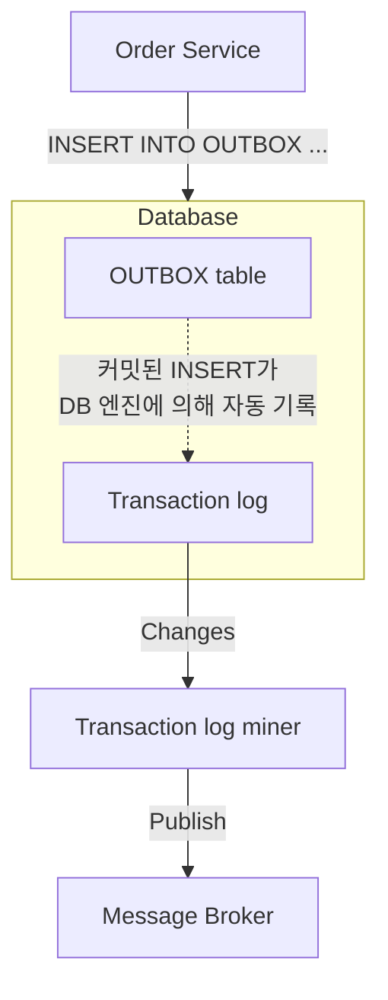

# Transaction Log Tailing 패턴 - Outbox를 CDC로 발행하는 흐름

아웃박스 패턴을 구현하는 두 방식(Polling Publisher / Transaction Log Tailing) 중 후자를 microservices.io 다이어그램 기준으로 컴포넌트별 흐름을 뜯어본 노트.

출처: https://techblog.woowahan.com/17386/

## 그림으로 보기

## 컴포넌트별 흐름

1. **Order Service → OUTBOX table**: 비즈니스 데이터 변경(주문 생성 등)과 `INSERT INTO OUTBOX ...`를 **같은 로컬 트랜잭션 안에서** 실행한다. 커밋되면 둘 다 커밋, 롤백되면 둘 다 롤백 — 같은 DB 트랜잭션이니 원자성은 공짜로 얻는다.
2. **Committed inserts → Transaction log**: OUTBOX 테이블에 대한 커밋된 INSERT는 애플리케이션이 신경 쓰지 않아도 DB 엔진 자체가 트랜잭션 로그(MySQL binlog, PostgreSQL WAL 등)에 자동으로 남긴다. 원래 복제·장애복구용으로 DB가 관리하는 로그라 애플리케이션이 별도 작업을 할 필요가 없다.
3. **Transaction log → Transaction log miner**: 별도 프로세스(트랜잭션 로그 마이너)가 이 로그를 계속 읽어서(tailing) OUTBOX 테이블에 생긴 변경분만 감지한다. 이게 **Debezium 같은 CDC 커넥터**가 하는 일이다.
4. **Transaction log miner → Message Broker (Publish)**: 감지한 변경 내용을 카프카 같은 메시지 브로커로 발행한다.

## Polling Publisher와 비교했을 때 유리한 점

- OUTBOX 테이블을 직접 SELECT로 폴링하지 않으므로 DB에 폴링 부하가 없고, 폴링 주기만큼의 지연도 없다(거의 실시간).
- 애플리케이션 코드는 로컬 트랜잭션에 INSERT 한 줄 추가하는 것 외에 발행을 전혀 신경 쓰지 않는다 — 발행 책임이 완전히 인프라(로그 마이너) 쪽으로 분리된다.
- 트랜잭션 로그는 커밋된 것만 기록하므로, 롤백된 변경이 애초에 로그에 나타나지 않아 "커밋 안 됐는데 이벤트가 나가는" 문제가 없다.

## 트레이드오프

- DB 엔진마다 트랜잭션 로그 포맷이 달라서 로그 마이너(CDC 커넥터)가 DB별로 특화되어야 한다.
- 트랜잭션 로그 삭제/압축 주기, 마이너 장애 시 재처리(오프셋 관리) 등 운영 복잡도가 추가된다.
- CDC 커넥터, Kafka Connect 같은 별도 인프라가 필요하다.

관련: 폴링 방식과의 비교, 그리고 "업무 테이블을 직접 CDC하면 메시지가 DB 스키마에 종속된다"는 함정은 [[아웃박스 패턴 심화 - 재시도, 순서 보장, Dual Write 문제]] 참고. 실제 우아한형제들 사례에서 아웃박스 테이블을 여러 개로 나누는 이유는 [[아웃박스 테이블 스키마]] 참고.

관련: 같은 팀 기술블로그에서 다룬 또 다른 카프카 활용 사례(이벤트 버스/브로드캐스트)는 [[카프카를 이벤트 버스로 써서 서버군 인메모리 값 동기화하기]] 참고.

## 한 줄 정리
> Transaction Log Tailing은 앱이 OUTBOX 테이블에 커밋만 하면, DB가 자동으로 남기는 트랜잭션 로그를 CDC 커넥터가 tail해서 메시지 브로커로 발행해주는 방식이다 — 폴링 부하와 발행 지연을 없애고, 발행 책임을 애플리케이션에서 인프라로 완전히 옮긴다.
