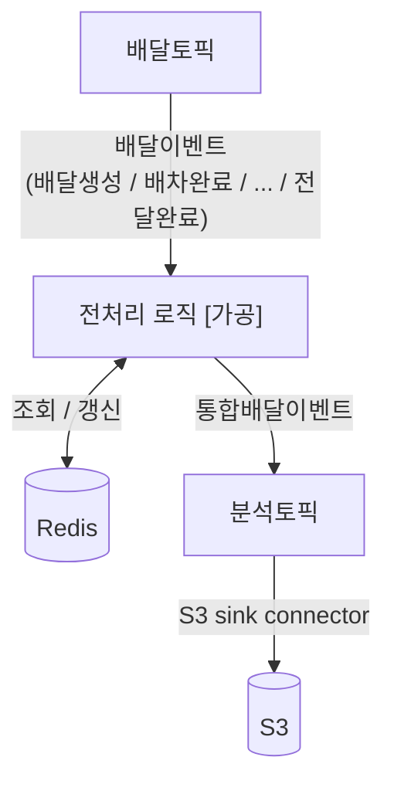
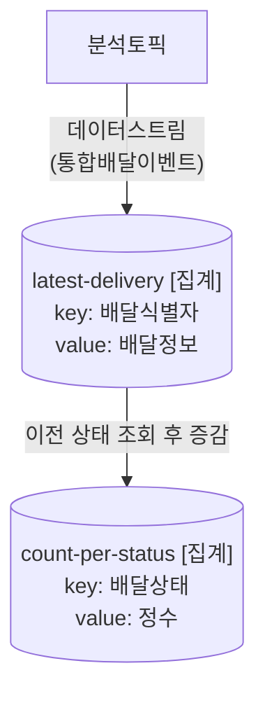

# 배달 분석 파이프라인에서 "가공"과 "집계"는 다른 단계다

우아한형제들 딜리버리서비스팀의 "실시간 배달 분석" 사례를 처음 읽으면 "분석 서버에 카프카 스트림즈를 적용해서 원본 이벤트를 받아 집계 및 가공을 한다"처럼 두 작업을 하나로 뭉쳐서 이해하기 쉽다. 실제로는 목적도 구현도 다른 별개의 두 단계다.

출처: https://techblog.woowahan.com/17386/

## 헷갈리기 쉬운 지점

"가공을 하는 이유는 분석용 토픽을 다루기 위함이다"처럼 인과관계도 살짝 뒤집어서 이해하기 쉽다. 정리하면:

| 단계 | 무엇을 하나 | 무엇으로 구현하나 |
|---|---|---|
| ① 가공(전처리) | 조각난 원본 이벤트(생성/배차/픽업/완료)를 배달 건 하나짜리 요약본으로 **통합** | Redis에 임시로 모아뒀다가 완료 시점에 통합이벤트 발행 — 카프카 스트림즈가 아니라 일반 컨슈머 + Redis 조합 |
| ② 집계 | 통합이벤트(또는 상태값)를 보고 "지금 상태별로 몇 건인지" **누적 카운트** | 카프카 스트림즈의 상태저장소(RocksDB 임베디드 DB + changelog 토픽) |

## 왜 가공하는지 — 인과관계 바로잡기

- **원인**: 원본 이벤트가 생성/배차/픽업/완료로 조각조각 흩어져 있어서, 그대로는 "이 배달이 어떻게 흘러갔는지"를 한눈에 보기 어렵다.
- **가공(해결책)**: 그래서 Redis로 조각을 모아 배달 건 하나짜리 요약 정보로 통합한다.
- **결과**: 그 통합된 결과물을 "분석 토픽"이라는 별도 토픽에 발행한다.

즉 "분석용 토픽을 다루기 위해 가공한다"가 아니라 "조각난 이벤트를 통합하기 위해 가공하고, 그 결과물이 분석 토픽에 담긴다"가 정확한 순서다. 분석 토픽은 가공의 목적이 아니라 가공 결과물이 담기는 그릇이다.

## 전체 흐름

```
원본 배달 토픽
   ↓
① 가공 (Redis로 조각 통합) ← 카프카 스트림즈 아님, 일반 컨슈머 + Redis
   ↓
분석 토픽 (통합된 배달이벤트)
   ↓
② 집계 (카프카 스트림즈 상태저장소) ← 여기가 진짜 "kafka-streams 적용" 지점
   ↓
그라파나 대시보드
```

## 그림으로 보기

우아한형제들 기술블로그의 실제 아키텍처 그림을 옮기면, "가공"과 "집계"가 완전히 분리된 두 그림으로 그려져 있다.

**가공 단계** — 배달토픽의 개별 이벤트를 Redis와 주고받으며 통합배달이벤트로 만들어 분석토픽에 발행하고, 분석토픽은 S3 sink connector로 S3에도 흘려보낸다.



- Redis와 양방향 화살표인 이유: 이벤트가 올 때마다 "이전 상태 조회 + 갱신"을 반복하기 때문 (Redis를 임시 작업대로 씀).
- 마지막 이벤트(전달완료)가 오면 그동안 모은 정보를 통합배달이벤트로 묶어 분석토픽에 발행.

**집계 단계** — 분석토픽의 통합배달이벤트를 카프카 스트림즈가 스트림으로 받아, 상태저장소 두 개를 순서대로 갱신한다.



- `latest-delivery`가 이전 노트에서 말한 "최신배달 저장소", `count-per-status`가 "상태별 개수 저장소"다.
- 레코드 하나가 `latest-delivery`(이전 상태 조회) → `count-per-status`(증감 반영) 순서로 토폴로지를 통과하며 처리된다.

왼쪽(가공)의 출력(분석토픽)이 오른쪽(집계)의 입력(분석토픽)이 되는 구조라서, 두 그림이 나란히 배치된 것 자체가 "가공과 집계는 분석토픽을 매개로 이어지는 별개의 두 단계"라는 걸 보여준다.

## 정리된 한 문장

> 분석 서버는 원본 배달 이벤트를 받아서, 먼저 Redis로 조각난 이벤트를 배달 건 단위로 통합(가공)해서 분석 토픽에 발행한다. 그리고 이 분석 토픽에 대해 별도로 카프카 스트림즈를 적용해서, 상태별 건수를 실시간으로 집계한다. 이때 집계값은 카프카 스트림즈의 상태저장소(RocksDB 임베디드 DB)에 관리된다.

관련: 가공(전처리) 단계의 Redis 통합 방식은 [[배달 이벤트를 분석용으로 가공해 S3·Athena로 영구 저장하기]] 참고. 집계 단계의 카프카 스트림즈 구현(상태저장소, Processor API)은 [[카프카 스트림즈로 배달 상태별 건수 실시간 집계하기]] 참고.

## 한 줄 정리
> "가공"은 조각난 원본 이벤트를 배달 건 단위로 통합해 분석 토픽에 발행하는 별도의 전처리 단계(Redis 기반)이고, "집계"는 그 분석 토픽을 대상으로 카프카 스트림즈가 상태별 건수를 누적 계산하는 완전히 다른 단계다. 분석 토픽은 가공의 목적이 아니라 가공 결과가 담기는 그릇일 뿐이다.
