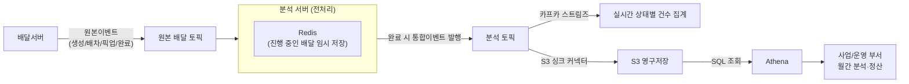

# 배달 이벤트를 분석용으로 가공해 S3·Athena로 영구 저장하기

우아한형제들 딜리버리서비스팀의 "실시간 배달 분석" 사례 중, [[카프카 스트림즈로 배달 상태별 건수 실시간 집계하기]]로 넘어가기 전 단계 — 원본 이벤트를 어떻게 분석하기 좋은 형태로 가공하고, 그 결과를 어디에 어떻게 영구 저장하는지 정리.

## 왜 배치 대신 카프카 스트림즈 계열을 쓰나

배치는 "1시간마다", "하루에 한 번"처럼 정해진 주기로 한꺼번에 처리한다. 문제는 주기 사이의 시차 — 1시간마다 배치를 돌리면 방금 발생한 배달 상황이 최대 1시간 뒤에야 반영된다. "지금 이 순간의 배달 현황"을 보고 싶은 요구사항에는 이 지연이 치명적이라, 실시간/준실시간으로 처리할 수 있는 카프카 스트림즈 계열 기술을 쓴다.

## 왜 원본 토픽과 분석용 토픽을 나누나

배달서버가 발행하는 원본 이벤트(배차완료, 픽업완료 등)는 실제 서비스 로직(배차, 알림)에 쓰이는 토픽이다. 이걸 그대로 분석에 쓰지 않고, 분석 서버가 원본 이벤트를 읽어서 조회하기 편한 형태로 가공한 뒤 **별도의 분석 토픽**에 새로 발행한다. 이유는 두 가지다.

1. **가공 필요**: 원본 이벤트는 서비스 로직 관점으로 만들어져서 분석하기 편한 형태가 아니다.
2. **부하·장애 분리**: 서비스 토픽과 분석 토픽은 트래픽 패턴도, 필요한 서버 자원도 다르다. 같은 토픽/서버를 같이 쓰면 분석 쪽 문제가 실제 배차 서비스까지 전파될 수 있으니, 인프라를 분리해서 한쪽이 죽어도 다른 쪽은 멀쩡하게 만든다.

## Redis로 조각난 이벤트를 배달 건 하나로 합치기

배달 하나는 생성 → 배차 → 픽업 → 완료 순서로 진행되며, 단계마다 이벤트가 **따로따로** 발행된다.

```
배달 12345번의 원본 이벤트 (시간 순서)
09:00 생성 이벤트
09:05 배차 이벤트
09:15 픽업 이벤트
09:30 완료 이벤트
```

운영자·대시보드 입장에서는 이 4개를 따로 보고 싶지 않고, "이 배달이 언제 생성돼서 언제 완료됐는지"를 한눈에 보고 싶어 한다. 그래서 **Redis를 임시 작업대**로 써서 조각을 하나로 합친다.

```
1. "생성" 이벤트 도착 → Redis에 배달 12345번 항목을 새로 만들고 주문/배달 정보 저장
   Redis: { deliveryId: 12345, createdAt: 09:00, status: "생성" }

2. "배차" 이벤트 도착 → 같은 항목을 찾아 업데이트
   Redis: { ..., assignedAt: 09:05, status: "배차" }

3. "픽업" 이벤트 도착 → 또 업데이트
   Redis: { ..., pickedAt: 09:15, status: "픽업" }

4. "완료" 이벤트 도착 → 마지막 업데이트 후,
   - 통합된 요약 정보를 "배달통합이벤트"로 만들어 분석 토픽에 발행
   - Redis에서는 이 배달 12345번 항목을 삭제 (더 이상 임시로 들고 있을 필요 없음)
```

Redis는 "아직 진행 중인 배달들의 중간 상태를 잠깐 들고 있는 작업 노트" 역할이고, 배달이 완료되는 순간 그 노트 내용을 정리해 분석 토픽에 최종본 하나로 발행한 뒤 노트는 찢어버리는(삭제하는) 셈이다.

## S3 싱크 커넥터 + Athena로 영구 저장·장기 분석

분석 토픽에 쌓인 "배달통합이벤트"는 **S3 싱크 커넥터**를 통해 AWS S3에 그대로 복사되어 영구 보관된다.

- **왜 굳이 S3에 또 저장하나**: 분석 토픽(카프카) 자체는 보관 기간이 있어 오래된 데이터가 지워질 수 있는데, S3는 영구 보관용이다. "비즈니스 서비스가 쓰는 저장소(DB)"와 "분석용 영구 저장소(S3)"를 분리해두면, 사업부서가 지난 몇 달치 데이터를 몰아서 조회해도 실제 서비스 DB에는 부하가 안 간다.
- **AWS Athena**는 S3에 쌓인 파일을 SQL로 조회할 수 있게 해주는 도구다. 이를 이용해 사업/운영 부서가 "지난달 배달 건수", "정산용 집계" 같은 걸 서비스에 지장 없이 조회한다.

## 전체 흐름



"이벤트가 조각조각 흩어져 있으면 분석하기 어려우니, Redis로 조각을 모아 배달 건 하나짜리 완성본을 만들고, 그걸 서비스와 분리된 별도 토픽·저장소(S3)에 쌓아서 서비스에 영향 없이 장기 분석까지 가능하게 한다"는 것이 핵심이다.

관련: "가공"(이 노트)과 "집계"(다음 노트)를 하나로 혼동하기 쉬운데 왜 별개 단계인지는 [[배달 분석 파이프라인에서 가공과 집계는 다른 단계다]] 참고. 이 분석 토픽을 카프카 스트림즈로 실시간 집계하는 다음 단계는 [[카프카 스트림즈로 배달 상태별 건수 실시간 집계하기]] 참고. 카프카가 이런 실시간 파이프라인에 적합한 구조적 근거(순차 I/O·zero-copy 등)는 [[카프카가 대량 데이터 처리와 실시간 전송에 강한 이유]] 참고. 같은 딜리버리서비스팀 기술블로그의 다른 카프카 활용 사례는 [[카프카를 이벤트 버스로 써서 서버군 인메모리 값 동기화하기]] 참고.

## 한 줄 정리
> 배치의 지연 문제 때문에 실시간 처리가 필요했고, 서비스 토픽과 분석 토픽을 분리해 장애 영향을 격리했다. 조각난 배달 이벤트는 Redis에 임시로 모아뒀다가 완료 시점에 통합이벤트 하나로 분석 토픽에 발행하고, 그 결과는 S3 싱크 커넥터로 영구 저장해 Athena로 서비스 DB에 부하 없이 장기 분석·정산에 활용한다.
