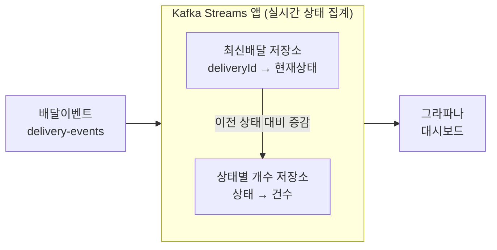

# 카프카 스트림즈로 배달 상태별 건수 실시간 집계하기

우아한형제들 딜리버리서비스팀의 "실시간 배달 분석" 사례. 배치 집계로는 안 되고 왜 카프카 스트림즈가 필요했는지, 있을 때와 없을 때 뭐가 다른지, 실제로 어떻게 코드로 구현하는지 정리.

## 카프카 스트림즈란

카프카 토픽에 들어오는 메시지를 실시간으로 읽어서 가공·집계한 뒤, 그 결과를 다시 카프카(또는 조회 가능한 저장소)로 내보내는 스트림 처리 라이브러리다. Spark나 Flink처럼 별도 클러스터가 필요한 게 아니라, `kafka-streams` 의존성 하나만 추가하면 되는 일반 자바 라이브러리라 배포 단위가 보통의 스프링 앱과 같다.

일반 컨슈머와의 차이는 **상태(state)를 들고 계산할 수 있다**는 것이다. "지금까지 들어온 이벤트 중 상태별 건수"처럼 누적 집계가 필요한 연산을, 로컬 상태저장소(statestore, 내부적으로 RocksDB + 변경 로그 토픽으로 장애 복구까지 지원)로 프레임워크 차원에서 관리해준다.

## 왜 필요했나 — 두 단계 상태저장소 구조

요구사항은 "지금 이 순간 배달이 각 상태(배차중/픽업중/배송중/완료 등)별로 몇 건씩 있는지"를 그라파나 대시보드에 실시간으로 보여주는 것. 단순히 이벤트를 저장하는 게 아니라 **계속 갱신되는 누적 집계값**을 유지해야 한다.

그래서 두 단계 상태저장소를 쓴다.

- **최신배달 저장소**: 배달 건마다 "지금 현재 상태가 뭔지"만 저장 (`deliveryId → 현재상태`)
- **상태별 개수 저장소**: 상태값별 카운트 (`상태 → 건수`)

이 두 단계가 필요한 이유가 핵심이다. 배달 상태가 "배차중 → 픽업중"으로 바뀌는 이벤트가 오면, 단순히 "픽업중 카운트 +1"만 하면 안 된다. **이전 상태였던 "배차중" 카운트도 -1** 해줘야 정확한 값이 유지된다. 그런데 새 이벤트 하나만 봐서는 이 배달이 방금까지 어떤 상태였는지 알 수 없으므로, 먼저 최신배달 저장소를 조회해서 이전 상태를 찾아낸 뒤 그 값을 -1, 새 상태를 +1 하는 식으로 상태별 개수 저장소를 갱신한다. 이런 "이전 상태를 즉시 조회 + 갱신"을 매 이벤트마다 빠르게 해줄 수 있는 게 카프카 스트림즈의 상태저장소(로컬 디스크/메모리라 조회가 빠름)다.

## 그림으로 보기



## 구체 예시로 상태저장소 두 개가 어떻게 바뀌는지 보기

배달 3건(A, B, C)이 있고, 상태는 배차중 → 픽업중 → 배송중 → 완료 순서로 바뀐다고 하자.

**`latest-delivery`(key: 배달식별자, value: 배달데이터)** — 배달 이벤트가 올 때마다 그 배달 건의 최신 상태만 계속 덮어쓴다. ("레코드의 시간을 기준값으로 최신 배달을 판단"한다는 게 이 부분이다.)

```
09:00  A 배차중 발생  → latest-delivery: { A: 배차중 }
09:01  B 배차중 발생  → latest-delivery: { A: 배차중, B: 배차중 }
09:05  A 픽업중 발생  → latest-delivery: { A: 픽업중, B: 배차중 }   ← A만 갱신됨
09:06  C 배차중 발생  → latest-delivery: { A: 픽업중, B: 배차중, C: 배차중 }
```

**`count-per-status`(key: 배달상태, value: 개수)** — `latest-delivery`가 바뀔 때마다 바뀌기 전 상태는 -1, 바뀐 후 상태는 +1 해서 함께 갱신된다.

```
09:00  A: (없음)→배차중   → count-per-status: { 배차중: 1 }
09:01  B: (없음)→배차중   → count-per-status: { 배차중: 2 }
09:05  A: 배차중→픽업중   → count-per-status: { 배차중: 1, 픽업중: 1 }   ← 배차중 -1, 픽업중 +1
09:06  C: (없음)→배차중   → count-per-status: { 배차중: 2, 픽업중: 1 }
```

`count-per-status`를 그대로 그라파나 게이지에 꽂으면, 09:06 시점 대시보드에는 이렇게 표시된다.

```
[배차중: 2건]   [픽업중: 1건]   [배송중: 0건]   [완료: 0건]
```

실제로 배차중인 건 B, C 2건, 픽업중인 건 A 1건이라는 게 정확히 반영된 것이다. 만약 "배차중" 숫자가 계속 쌓이기만 하고 안 줄어든다면, 배차가 밀리고 있다는 신호로 바로 알아챌 수 있다 — "하나의 배달 상태에 몰려있진 않은지"를 대시보드로 파악한다는 게 이런 뜻이다.

## 실시간 데이터 제공의 활용 범위

배달 상태별 건수는 이 집계 구조를 활용하는 한 가지 예시일 뿐이고, 같은 방식(원하는 값을 key로 하는 상태저장소 + 이벤트마다 증감)으로 다음도 실시간 집계한다.

- 배차 대기로 남아있는 배달 건이 얼마나 되는지
- 현재 배차에 시간이 얼마나 걸리는지
- 주문서비스별 유입량은 어떻게 되는지

각각 그라파나 대시보드로 시각화해서 운영 대응과 배달인프라 분석에 함께 쓰인다.

## 베타 환경 대시보드 예시

`count-per-status`를 그대로 게이지·파이차트로 꽂으면 실제로 이런 모습이 된다 (우아한형제들 기술블로그의 베타 환경 캡처 기준).

![[카프카 스트림즈로 배달 상태별 건수 실시간 집계하기-20260917-163919.png]]

**배달상태별 배달 수 (게이지)**

| 배차대기 | 배차완료 | 픽업지도착 | 픽업완료 | 전달완료 | 배달취소 |
|---|---|---|---|---|---|
| 58 | 3 | 1 | 8 | 18 | 51 |

**진행 중인 배달상태 (파이차트)** — 완료·취소된 건을 뺀, 아직 진행 중인 배달만 놓고 비중을 본 것

| 상태 | 비중 |
|---|---|
| 배차대기 | 83% |
| 픽업완료 | 11% |
| 배차완료 | 4% |
| 픽업지도착 | 1% |

파이차트 쪽이 실무적으로 더 눈에 띄는 이유: 게이지의 "배차대기 58건"이라는 숫자 하나만 보면 많은 건지 적은 건지 감이 안 오는데, 파이차트로 "진행 중인 배달의 83%가 배차대기 상태"라는 **비율**로 보면 "배차 단계에서 심하게 정체되고 있다"는 이상 신호를 즉시 알아챌 수 있다. 이게 앞서 예시로 든 "배차중 숫자가 계속 쌓이기만 하는 상황"이 실제 운영 대시보드에서 어떻게 드러나는지 보여주는 사례다.

## 있고 없고 비교

**카프카 스트림즈 없이 (배치 처리로 대체한다면)**

```
원본 배달이벤트 → S3/DB에 계속 적재만 함
        ↓
매시간(또는 매일) 배치 잡이 실행
        ↓
쌓인 이벤트 전체(또는 그날 것)를 다시 읽어서
"현재 상태별로 몇 건인지" GROUP BY 재계산
        ↓
결과를 그라파나가 보는 테이블에 덮어쓰기
```

- **지연**: 배치 주기(1시간이면 최대 1시간)만큼 오래된 값을 본다. 운영 대시보드 용도로는 치명적.
- **매번 무거운 재계산**: 최신 상태를 구하려면 이벤트 이력을 전부(또는 증분만큼) 다시 훑어야 한다. 건수가 늘어날수록 배치 하나 도는 시간도 계속 늘어난다.
- **"이전 상태" 추적을 직접 구현**: 카운트를 정확히 유지하려면 결국 어디선가 "이 배달의 직전 상태"를 기억했다가 차감하는 로직이 필요한데, 이걸 배치 SQL이나 별도 테이블로 직접 설계·관리해야 한다.

**카프카 스트림즈 사용**

- **지연 없음**: 이벤트가 도착하는 즉시 카운트가 갱신되므로 대시보드가 거의 실시간(초 단위)으로 현재 상태를 보여준다.
- **가벼운 증분 갱신**: 매번 전체를 다시 계산하지 않고 "이전 상태 -1, 새 상태 +1"이라는 가벼운 연산만 한다. 데이터가 쌓여도 이벤트 하나 처리 비용은 늘지 않는다.
- **상태 관리가 프레임워크에 내장**: "이 배달의 직전 상태가 뭐였는지"를 최신배달 저장소가 자동으로 들고 있고, 장애 시 복구(변경 로그 토픽 백업)도 스트림즈가 관리해준다.

## 배치가 아니라 `spring-kafka` + Redis로 직접 짜면 안 되나

"카프카 스트림즈 없이"를 배치와만 비교하면 불공평하다. 더 현실적인 대안은 **`@KafkaListener`로 이벤트를 받아서 Redis에 카운트를 직접 갱신**하는 방식이다. 실제로 이 팀이 "배달 이벤트를 하나로 합치는" 전처리 단계는 이 방식(Redis 임시저장)을 쓴다. 그런데 "상태별 카운트 집계"에는 이 방식이 잘 안 맞는 이유가 있다.

```java
@KafkaListener(topics = "delivery-events")
public void onEvent(DeliveryEvent event) {
    redis.decrement("count:" + event.getPreviousStatus());
    redis.increment("count:" + event.getNewStatus());
    // 이 메서드가 끝나면 오프셋이 자동 커밋됨
}
```

문제는 "Redis 카운트 갱신"과 "카프카 오프셋 커밋"이 **서로 다른 두 시스템에 걸친 쓰기**라서 원자적이지 않다는 것 — [[아웃박스 패턴 심화 - 재시도, 순서 보장, Dual Write 문제]]에서 다룬 dual write 문제가 그대로 재현된다.

```
Redis 갱신 성공 → 오프셋 커밋 전에 서버 다운
  → 재시작 후 같은 이벤트 재처리 → Redis를 또 갱신 → 중복 집계(카운트 부풀어 오름)

오프셋 커밋 성공 → Redis 갱신 전에 서버 다운
  → 이 이벤트는 "처리 완료"로 기록됨 → 재시작해도 다시 안 읽음 → 카운트 누락(영원히 반영 안 됨)
```

가공(원본 이벤트 하나 받아서 변형 후 재발행)은 상태가 필요 없어서 이 문제가 없지만, 집계는 "지금까지의 누적 결과"를 계속 들고 있어야 해서 이 문제에 정확히 걸린다. 그리고 잘못돼도 즉시 터지지 않고 카운트가 조금씩 틀어지기만 해서 **알아채기 어렵다**는 게 더 나쁘다.

카프카 스트림즈는 상태저장소를 Redis 같은 **외부 시스템**이 아니라 **카프카 자신의 changelog 토픽**에 백업한다. 그래서 "상태 갱신 + 오프셋 커밋"이 두 시스템 사이의 문제가 아니라 카프카 하나 안에서 원자적으로 처리되고, 서버가 죽어도 changelog로 상태를 정확히 그 시점 그대로 복구할 수 있다. 위 "최신배달 저장소 → 상태별 개수 저장소" 구조가 RocksDB + changelog 토픽으로 관리되는 이유가 이것이다.

| | `spring-kafka` + Redis로 직접 집계 | 카프카 스트림즈 |
|---|---|---|
| 상태 저장 위치 | 외부 시스템(Redis) | 카프카 자신(changelog 토픽 백업) |
| 상태 갱신 + 오프셋 커밋의 원자성 | 보장 안 됨 (직접 트랜잭션 아웃박스 같은 장치를 만들어야 함) | 프레임워크가 내장 |
| 장애 복구 | Redis 값이 어느 시점 것인지 알 수 없어 복구 로직을 직접 설계 | changelog 토픽 재생으로 정확한 시점 복구 |
| 적합한 용도 | 상태 없는 단순 가공(이벤트 하나 받아 변형 후 재발행) | 누적 집계·윈도우 연산처럼 상태가 필요한 처리 |

## 실제로 어떻게 쓰는가

### 1. 의존성

```gradle
implementation 'org.apache.kafka:kafka-streams:3.7.0'
```

### 2. 기본 설정

```java
Properties props = new Properties();
props.put(StreamsConfig.APPLICATION_ID_CONFIG, "delivery-status-aggregator"); // 컨슈머그룹ID 겸용
props.put(StreamsConfig.BOOTSTRAP_SERVERS_CONFIG, "localhost:9092");
props.put(StreamsConfig.DEFAULT_KEY_SERDE_CLASS_CONFIG, Serdes.String().getClass());
props.put(StreamsConfig.DEFAULT_VALUE_SERDE_CLASS_CONFIG, Serdes.String().getClass());
```

`application.id`는 내부적으로 컨슈머 그룹 ID로도 쓰이고, 상태저장소를 복구할 변경 로그 토픽 이름의 접두사로도 쓰인다.

### 3. 단순 집계는 DSL로 충분

```java
StreamsBuilder builder = new StreamsBuilder();
KStream<String, String> deliveryEvents = builder.stream("delivery-events");

KTable<String, Long> countByStatus = deliveryEvents
    .groupBy((key, event) -> extractStatus(event))
    .count(Materialized.as("status-count-store"));

countByStatus.toStream().to("status-count-output");
```

다만 이것만으론 "이전 상태 카운트를 -1 해주는 로직"이 없어서, 상태가 바뀔 때마다 숫자가 계속 부풀어 오른다.

### 4. "이전 상태 대비 증감"이 필요할 때 — Processor API

```java
StoreBuilder<KeyValueStore<String, String>> latestStatusStore =
    Stores.keyValueStoreBuilder(
        Stores.persistentKeyValueStore("latest-delivery-store"),
        Serdes.String(), Serdes.String());

StoreBuilder<KeyValueStore<String, Long>> statusCountStore =
    Stores.keyValueStoreBuilder(
        Stores.persistentKeyValueStore("status-count-store"),
        Serdes.String(), Serdes.Long());

builder.addStateStore(latestStatusStore);
builder.addStateStore(statusCountStore);

deliveryEvents.process(() -> new Processor<String, String, Void, Void>() {
    private KeyValueStore<String, String> latestStore;
    private KeyValueStore<String, Long> countStore;

    @Override
    public void init(ProcessorContext<Void, Void> context) {
        latestStore = context.getStateStore("latest-delivery-store");
        countStore = context.getStateStore("status-count-store");
    }

    @Override
    public void process(Record<String, String> record) {
        String deliveryId = record.key();
        String newStatus = extractStatus(record.value());
        String prevStatus = latestStore.get(deliveryId);        // ① 이전 상태 조회

        if (prevStatus != null) {
            countStore.put(prevStatus, countStore.get(prevStatus) - 1); // ② 이전 상태 -1
        }
        countStore.put(newStatus,
            (countStore.get(newStatus) == null ? 0 : countStore.get(newStatus)) + 1); // ③ 새 상태 +1

        latestStore.put(deliveryId, newStatus);                  // ④ 최신 상태 갱신
    }
}, "latest-delivery-store", "status-count-store");
```

이게 위 다이어그램의 "최신배달 저장소 → 상태별 개수 저장소" 구조가 코드로 구현된 모습이다.

### 5. 실행

```java
Topology topology = builder.build();
KafkaStreams streams = new KafkaStreams(topology, props);
Runtime.getRuntime().addShutdownHook(new Thread(streams::close));
streams.start();
```

### 6. 외부(그라파나)에서 결과 조회

- **Interactive Queries**: 스트림즈 앱 안에 REST 엔드포인트를 열어서 `streams.store(...)`로 로컬 상태저장소 값을 바로 조회
- **출력 토픽으로 흘려보내기**: 갱신될 때마다 결과를 별도 토픽으로 내보내고, 싱크 커넥터로 DB/타임시리즈DB에 적재 → 그라파나가 그 DB를 조회

관련: 카프카의 순차 I/O·페이지 캐시·zero-copy 같은 실시간성의 기반 구조는 [[카프카가 대량 데이터 처리와 실시간 전송에 강한 이유]] 참고. 같은 딜리버리서비스팀 기술블로그의 다른 카프카 활용 사례는 [[카프카를 이벤트 버스로 써서 서버군 인메모리 값 동기화하기]] 참고. 이 노트가 다루는 집계 이전 단계 — 원본 이벤트를 Redis로 통합하고 분석 토픽·S3로 흘려보내는 전처리 과정은 [[배달 이벤트를 분석용으로 가공해 S3·Athena로 영구 저장하기]] 참고. "가공"과 "집계"를 하나로 혼동하기 쉬운데 왜 별개 단계인지는 [[배달 분석 파이프라인에서 가공과 집계는 다른 단계다]] 참고.

## 한 줄 정리
> 단순히 "이벤트를 모아서 나중에 한 번에 집계"하는 거라면 배치로도 충분하지만, "매 순간 정확한 현재 상태별 카운트"가 필요하고 그 카운트가 이전 값에서 증감하는 방식(상태 전이)으로 계산돼야 한다는 점 때문에 카프카 스트림즈의 상태저장소(최신배달 저장소 → 상태별 개수 저장소)가 정확히 맞아떨어지는 도구였다. 단순 집계는 DSL(`count`)로 충분하지만, 이전 값을 참조해 증감시키는 로직은 Processor API로 상태저장소를 직접 다뤄야 한다.
