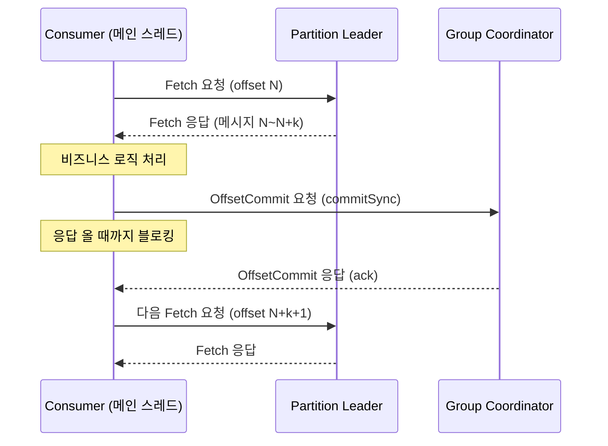
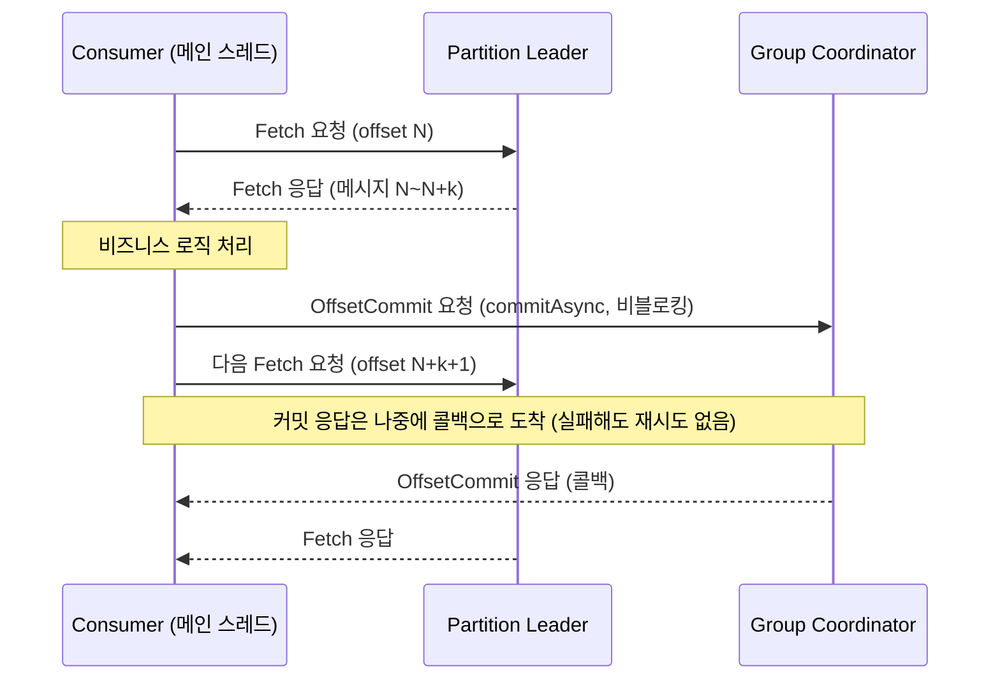

# 수동 커밋 시 Fetch 요청과 Commit 요청은 어떻게 동작하는가

`enable.auto.commit=false`로 두고 `commitSync()`/`commitAsync()`를 직접 호출할 때, Fetch 요청과 Commit 요청이 서로 어떤 관계로 오가는지 헷갈리기 쉽다. 결론부터 말하면 **프로토콜상 완전히 독립된 두 요청이지만, 동기 커밋을 쓰는 일반적인 단일 스레드 루프에서는 코드 실행 순서 때문에 순차적으로 보인다.**

## 1. 프로토콜 레벨 — 애초에 다른 종류의 요청

| | Fetch 요청 | OffsetCommit 요청 |
|---|---|---|
| 목적 | 메시지 가져오기 | "여기까지 처리했다"를 브로커에 기록 |
| 보내는 대상 | 해당 파티션의 **리더 리플리카** | 컨슈머 그룹의 **Group Coordinator** (리더와 다른 브로커일 수 있음, [[Group Coordinator와 Controller 차이]] 참고) |
| API 종류 | Fetch API | OffsetCommit API |

같은 브로커로 갈 수도, 완전히 다른 브로커로 갈 수도 있는 독립적인 요청이다. Kafka 프로토콜 자체는 둘 사이에 순서를 강제하지 않는다.

## 2. 애플리케이션 레벨 — commitSync를 쓰는 동기 루프의 경우

가장 흔한 패턴(단일 스레드, 처리 후 동기 커밋)은 이렇게 진행된다.

```
poll() → Fetch 요청 전송 & 응답 수신 (메시지 받음)
   ↓
비즈니스 로직 처리
   ↓
commitSync() 호출 → OffsetCommit 요청 전송
   ↓ (메인 스레드가 여기서 블로킹, 코디네이터 응답 대기)
commitSync() 응답(ack) 수신 → 함수 리턴
   ↓
다음 poll() 호출 → 그제서야 다음 Fetch 요청 전송
```

`commitSync()`는 이름 그대로 동기 호출이라 브로커의 커밋 완료 응답을 받을 때까지 메인 스레드를 붙잡아둔다. 그 다음 줄(보통 while 루프의 다음 `poll()`)이 실행돼야 다음 Fetch가 나가므로, 결과적으로 "커밋 응답을 받아야 다음 Fetch가 간다"는 순서가 만들어진다.

**중요한 건 이게 Kafka의 설계 규칙이 아니라, 코드가 한 줄씩 순차 실행되고 `commitSync`가 블로킹 호출이기 때문에 생기는 결과라는 점이다.** 프로토콜은 둘 사이에 의존관계를 요구하지 않는다.

시퀀스로 그리면 이렇다 — Fetch는 파티션 리더에게, Commit은 Group Coordinator에게 가는(대상이 다를 수 있는) 별개 요청인데, 메인 스레드가 순차 실행되니 결과적으로 아래처럼 한 줄로 이어진다.



## 3. commitAsync를 쓰면 달라진다

`commitAsync()`는 응답을 기다리지 않고 즉시 다음 코드로 넘어간다. 그래서:

- OffsetCommit 요청이 브로커에 아직 도달/처리되지 않은 상태에서 다음 poll()의 Fetch 요청이 먼저 나갈 수 있다.
- 처리량은 좋아지지만, 커밋 실패를 즉시 알 수 없어서 보통 콜백으로 실패만 로깅하고 별도 재시도는 하지 않는 게 일반적이다.

commitSync와 비교하면, 블로킹 구간이 없어서 Commit 응답을 기다리지 않고 바로 다음 Fetch가 나간다 — 즉 Fetch와 Commit이 시간상 겹칠 수 있다.



## 4. 하트비트는 이 흐름과 완전히 무관하다

Fetch/Commit이 메인 스레드에서 순차적으로 돌아가는 동안에도, 하트비트는 별도의 백그라운드 스레드가 독립적으로 계속 보낸다. 그래서 `commitSync()`가 오래 블로킹돼도(코디네이터 응답이 늦어져도) 그 자체로는 `session.timeout.ms`를 건드리지 않는다. 다만 비즈니스 로직 처리 자체가 오래 걸려서 다음 `poll()` 호출이 늦어지면 `max.poll.interval.ms`가 발동할 수 있다 ([[session.timeout.ms와 max.poll.interval.ms 차이]] 참고).

## 한 줄 정리
> Fetch와 OffsetCommit은 프로토콜상 독립된 별개 요청(대상 브로커도 다를 수 있음)이지만, `commitSync()`를 쓰는 단일 스레드 동기 루프에서는 블로킹 호출 때문에 "커밋 응답을 받아야 다음 Fetch가 나간다"는 순서로 보인다 — 이건 Kafka가 강제하는 게 아니라 코드 실행 순서의 결과다. `commitAsync()`를 쓰면 이 순차성이 깨진다.
