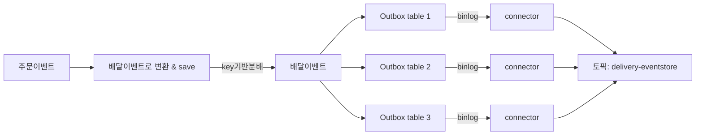
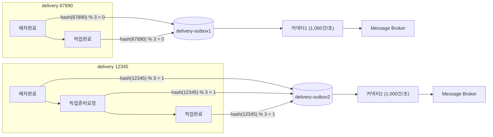

# 아웃박스 테이블을 식별자로 샤딩해서 커넥터 처리량 늘리기

우아한형제들 딜리버리서비스팀 사례에서 나온 내용 — 아웃박스 테이블 하나 + CDC 커넥터 하나로는 유입량이 처리량을 넘어서면 지연이 계속 쌓이는데, 이걸 어떻게 병렬화하는지 정리.

## 문제 상황

`delivery-outbox` 테이블 하나에 모든 배달 이벤트가 INSERT되고, 여기 Debezium 커넥터 하나가 붙어 카프카로 발행한다고 하자. 테이블에 데이터가 쌓이는 속도가 커넥터의 처리 속도보다 빠르면, 처리되지 못한 만큼 계속 쌓여서 메시지 지연이 점점 벌어진다.

```
유입: 3,000건/초 ──▶ [delivery-outbox] ──▶ 커넥터1 (처리: 1,000건/초)
                                              → 초당 2,000건씩 밀림 (지연 누적)
```

## 해법: 식별자 기반으로 테이블 자체를 N개로 쪼갠다

배달식별자(`deliveryId`)를 기준으로 어느 outbox 테이블에 쓸지 미리 정한다.

```
table = hash(deliveryId) % 3
```

```
hash(12345) % 3 = 1  →  delivery-outbox2
hash(67890) % 3 = 0  →  delivery-outbox1
hash(54321) % 3 = 2  →  delivery-outbox3
```

12345번 배달의 이벤트(배차완료 → 픽업준비요청 → 픽업완료)는 전부 `delivery-outbox2`에 순서대로 INSERT된다.

```
delivery-outbox2 (auto-increment id 순서)
id=101: 배차완료(12345)
id=102: 픽업준비요청(12345)
id=103: 픽업완료(12345)
```

`delivery-outbox2`에는 **커넥터2 하나만** 연결되어 있어서, 이 테이블의 트랜잭션 로그를 id 순서(101→102→103) 그대로 읽어 카프카에 발행한다. 다른 커넥터가 끼어들 여지가 없으므로 같은 키(같은 배달)의 이벤트 순서는 그대로 보장된다.

## 원본 아키텍처 그림

우아한형제들 기술블로그에 실린 실제 구조는 이렇다. 주문이벤트를 배달이벤트로 변환해서 저장하는 시점에 key 기반으로 3개의 outbox 테이블에 분배하고, 각 테이블의 binlog를 각자의 커넥터가 tail해서 **하나의 토픽(`delivery-eventstore`)으로 합류**시킨다.



이 그림에서 중요한 포인트 두 가지:

- **분배는 저장 시점에 일어난다**: 배달이벤트로 변환해서 save하는 그 순간 key 기반으로 어느 outbox 테이블에 넣을지 정해진다. 이게 앞서 본 `table = hash(deliveryId) % 3` 계산이 실제로 벌어지는 지점이다.
- **커넥터는 테이블별로 나뉘지만 발행 목적지(토픽)는 하나로 합류한다**: 커넥터 자체는 테이블마다 독립적으로 병렬 동작해서 처리량을 분산하지만, 최종적으로는 전부 같은 토픽(`delivery-eventstore`)으로 모인다 — 컨슈머 입장에서는 토픽 하나만 구독하면 되고, 내부적으로 발행 경로만 3갈래로 나뉘어 있는 셈이다.

## 예시로 보기



## 처리량이 늘어나는 이유

동시에 67890번 배달의 이벤트는 `delivery-outbox1`에, 54321번 배달의 이벤트는 `delivery-outbox3`에 각각 쌓이고, **커넥터1, 커넥터3이 독립적으로 병렬 처리**한다.

```
유입 3,000건/초 = 1,000+1,000+1,000건/초로 3분할
[delivery-outbox1] → 커넥터1 (1,000건/초) ✓ 밀리지 않음
[delivery-outbox2] → 커넥터2 (1,000건/초) ✓ 밀리지 않음
[delivery-outbox3] → 커넥터3 (1,000건/초) ✓ 밀리지 않음
```

커넥터 한 개가 처리할 수 있는 최대치가 1,000건/초로 고정돼 있어도, 테이블(그리고 커넥터)을 3개로 나누면 시스템 전체 처리량은 3,000건/초까지 늘어난다. 각 테이블 안에서는 여전히 하나의 커넥터만 담당하므로 같은 키의 이벤트 순서는 깨지지 않는다.

## 왜 카프카 파티션을 늘리는 것만으론 부족한가

카프카 토픽의 파티션을 늘려도 컨슈머 병렬성은 늘지만, 그 앞단인 **CDC 커넥터가 테이블 하나만 tail하는 구조라면 발행 자체가 병목**이 된다. 그래서 컨슈머 쪽 병렬화(파티션)와는 별개로, 발행 쪽 병렬화(outbox 테이블 자체를 나누고 커넥터도 그만큼 붙이는 것)가 따로 필요하다.

관련: 같은 "식별자를 해시해서 같은 곳으로 몰아 순서를 지키는" 메커니즘을 카프카 파티션 레벨에서 다룬 노트 — [[키 기반 파티션 배정으로 이벤트 순서 보장하는 법 - 구체 예시]]. CDC 커넥터가 트랜잭션 로그를 tail하는 기본 구조는 [[Transaction Log Tailing 패턴 - Outbox를 CDC로 발행하는 흐름]], 테이블 컬럼 설계는 [[아웃박스 테이블 스키마]] 참고.

## 한 줄 정리
> 아웃박스 테이블 하나 + 커넥터 하나 구조는 유입량이 처리량을 넘으면 지연이 계속 쌓인다. 식별자를 해시해서 outbox 테이블을 N개로 쪼개고 테이블마다 커넥터를 하나씩 붙이면, 같은 키는 항상 같은 테이블로 가서 순서는 유지하면서 전체 처리량은 N배로 늘릴 수 있다.
