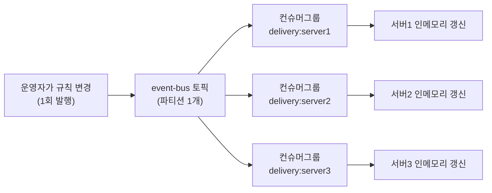

# 카프카를 이벤트 버스로 써서 서버군 인메모리 값 동기화하기

우아한형제들 딜리버리서비스팀 사례. "이벤트 버스"라는 말이 낯설었는데, 평소 익숙한 카프카 사용법(일감 나눠 갖기)과 정반대 목적(모두에게 방송하기)이라는 걸 알고 나니 이해가 됐다.

## 왜 인메모리에 값을 들고 있나

배달서버는 주문이 들어올 때마다 "이 주문을 어디로 배정할지"를 즉시 결정해야 한다. 예를 들면 이런 규칙이다.

```
RouteRuleSet (인메모리 Map)
{
  "강남구": "라이더그룹A",
  "송파구": "라이더그룹B",
  "종로구": "라이더그룹A"
}
```

이 결정은 초당 수백~수천 건씩 벌어지는 빈번한 연산이라, 매번 DB를 조회하면 부하·지연이 커진다. 그래서 서버가 시작할 때(또는 값이 바뀔 때) 한 번 읽어서 메모리(Map 등)에 캐시해두고, 요청 처리 중에는 그 메모리 값만 참조한다.

## 왜 서버군 전체가 동시에 갱신되어야 하나

배달서버가 3대(delivery-1/2/3)라고 하자. 운영자가 "강남구는 이제 라이더그룹C로 보내라"고 바꿨는데 delivery-1만 갱신되고 나머지는 옛 규칙을 들고 있다면:

```
강남구 주문 → delivery-1이 처리 → 라이더그룹C 배정 (새 규칙)
강남구 주문 → delivery-2가 처리 → 라이더그룹A 배정 (옛 규칙)
강남구 주문 → delivery-3이 처리 → 라이더그룹A 배정 (옛 규칙)
```

같은 강남구 주문인데 어느 서버가 처리하느냐에 따라 결과가 달라지는 비일관성이 생긴다. 그래서 규칙이 바뀌는 순간 서버군 전체가 동시에 갱신돼야 한다.

## 평소 카프카 사용법과의 차이 — "나눠 갖기" vs "다 같이 받기"

평소 컨슈머 그룹은 **일감을 나눠 갖는** 용도다. 같은 그룹 안에서는 메시지 하나를 그룹 내 컨슈머 중 딱 하나만 소비한다(처리량 분산).

```
토픽(파티션 3개) + 컨슈머그룹 "order-processor" (인스턴스 3대)
→ P0는 인스턴스1, P1은 인스턴스2, P2는 인스턴스3이 소비
→ 메시지 하나는 셋 중 하나만 처리
```

그런데 분배 규칙 변경은 반대다. 메시지 하나를 **서버 전부가 각자** 받아서 자기 인메모리를 갱신해야 한다. 이게 이벤트 버스(=방송, broadcast) 개념이다.

## 카프카로 방송을 구현하는 방법 — 그룹 자체를 서버 수만큼 쪼갠다

핵심은 "그룹 내부에서 여러 컨슈머가 나눠 갖는" 게 아니라 **그룹 자체를 서버 개수만큼 쪼개는** 것이다. 각 그룹은 멤버가 딱 1명(그 서버 자신)이다.

```
❌ 오해: 그룹 하나 + 컨슈머 3개 (그룹 내부에서 나눠 가짐 — 하나만 받음)
✅ 실제: 그룹 3개 + 각 그룹에 컨슈머 1개 (그룹끼리는 서로 독립적으로 전체를 다 읽음)
```

카프카에서 오프셋은 **컨슈머 그룹 단위**로 관리되므로, 서로 다른 그룹은 완전히 남남이다. 각자 자기 오프셋으로 토픽을 처음부터 끝까지 독립적으로 읽는다. 그래서 컨슈머 그룹 ID를 `${서버명}:${식별자}` 형식으로 서버마다 다르게 주면, 발행은 한 번인데 그룹 수(=서버 수)만큼 독립적으로 배달되는 결과가 나온다.



파티션은 처리량이 크게 필요 없어 1개로 관리한다 — 필요한 건 처리량 분산이 아니라 "같은 서버군이 같은 변경사항을 받는 것"이기 때문이다.

## RemoteApplicationEvent는 이 방송 위에 목적지를 얹는 포장지

스프링 클라우드의 `RemoteApplicationEvent`는 위 브로드캐스트 메커니즘 위에 "이 이벤트가 어떤 서버군을 향한 것인가"라는 라우팅 정보를 추가해주는 추상화다.

```java
public abstract class DeliveryServiceRemoteApplicationEvent extends RemoteApplicationEvent {
    protected DeliveryServiceRemoteApplicationEvent(String destination) {
        super(SOURCE, ORIGIN, DESTINATION_FACTORY.getDestination(destination));
    }
}

public class RouteRuleRemoteEvent extends DeliveryServiceRemoteApplicationEvent {
    public RouteRuleRemoteEvent() {
        super("delivery"); // destination: 배달서버군
    }
}
```

발행 측(규칙을 변경한 서버)과 수신 측(모든 배달서버) 코드:

```java
public void load() {
    routeRuleSetStore.load();
    remoteApplicationEventPublisher.publishEvent(new RouteRuleRemoteEvent());
}

@EventListener
public void handle(RouteRuleRemoteEvent event) {
    routeRuleSetStore.load();  // 자기 인메모리도 다시 읽어옴
}
```

발행한 서버 자신도 `@EventListener`로 같은 이벤트를 구독하고 있어서, 결과적으로 발행자를 포함한 서버군 전체가 동일한 절차(`routeRuleSetStore.load()`)로 인메모리를 갱신한다.

## anonymous 컨슈머 그룹

컨슈머 이름을 따로 지정하지 않으면 스프링 클라우드가 `anonymous.{식별자}` 형식으로 랜덤 그룹 ID를 자동 부여한다. 연결된 서버 수만큼 `anonymous.*` 그룹이 계속 생기므로, 모니터링 시에는 이 anonymous 그룹들을 필터링해서 노이즈를 줄인다.

## 한 줄 정리
> 평소 컨슈머 그룹은 메시지를 그룹 내에서 나눠 갖는 용도지만, 서버군 전체가 같은 인메모리 값을 동시에 갱신해야 하는 상황에서는 반대로 "모두가 받아야" 한다. 이를 위해 서버마다 컨슈머 그룹 ID를 다르게 줘서(그룹 자체를 서버 수만큼 쪼개서) 한 번의 발행이 모든 서버에 독립적으로 전달되게 하는 것이 카프카를 이벤트 버스로 쓰는 방식이고, `RemoteApplicationEvent`는 그 위에 "어떤 서버군을 향한 이벤트인지" 목적지를 얹어주는 스프링 클라우드의 추상화다.
