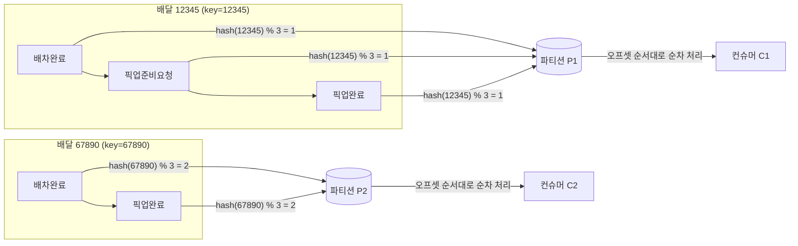

# 키 기반 파티션 배정으로 이벤트 순서 보장하는 법 - 구체 예시

배민 딜리버리서비스팀 기술블로그에서 "배차완료 다음에 픽업준비요청이 오는 순서를 어떻게 보장하는가"를 다룬 걸 보고, 실제로 파티션이 어떤 계산으로 배정되는지 구체적인 숫자로 뜯어본 노트.

## 문제 상황

배차완료와 픽업준비요청은 프로듀서 쪽에서는 순서대로(배차완료 → 픽업준비요청) 발행되지만, 네트워크 지연 등으로 컨슈머가 반대 순서로 받을 수도 있다. 이러면 컨슈머 입장에서 어떤 이벤트가 먼저 발생한 건지 알 수 없어서 비즈니스 로직이 꼬인다.

## 해법: 같은 엔티티는 같은 파티션으로

카프카는 **파티션 하나 내부에서는** 프로듀서가 쓴 순서 그대로 저장되고, 컨슈머도 그 순서(오프셋 순)대로만 읽는다. 그리고 카프카 기본 파티셔너는 키를 해시해서 파티션을 결정한다.

```
partition = hash(key) % 파티션수
```

같은 키를 가진 메시지는 항상 같은 계산 결과가 나오므로 항상 같은 파티션에 들어간다.

## 구체 예시

`delivery-events` 토픽이 파티션 3개(P0, P1, P2)로 구성되어 있다고 하자. 배달 12345번 건에서 다음 이벤트가 발생한다.

1. 배차완료 (key = "12345")
2. 픽업준비요청 (key = "12345")
3. 픽업완료 (key = "12345")

키가 전부 `"12345"`로 동일하므로 `hash("12345") % 3`도 항상 같은 값(예: 1)이 나오고, 세 이벤트는 전부 **파티션 P1**에 발행 순서대로 쌓인다.

```
P1: [배차완료(12345)] → [픽업준비요청(12345)] → [픽업완료(12345)]
```

다른 배달 건(`deliveryId=67890`)은 키가 다르므로 다른 파티션(P2)에 쌓일 수 있다.

```
P0: (다른 배달 건)
P1: [배차완료(12345)] → [픽업준비요청(12345)] → [픽업완료(12345)]
P2: [배차완료(67890)] → [픽업완료(67890)]
```

컨슈머 그룹 내에서는 파티션 하나에 컨슈머 하나만 할당되므로, P1에 쌓인 12345번 배달의 이벤트는 **항상 같은 컨슈머가 순서대로** 처리한다. 배차완료를 처리하기 전에 픽업준비요청이 먼저 처리되는 일이 구조적으로 발생하지 않는다.

## 그림으로 보기



같은 키(같은 배달 건)의 이벤트는 항상 같은 파티션으로 모이고, 그 파티션은 컨슈머 하나가 오프셋 순서 그대로 처리하기 때문에 순서가 깨지지 않는다. 반대로 다른 배달 건은 다른 파티션에 흩어져 병렬로 처리돼도 문제없다.

## 키를 안 쓰면 어떻게 되나

키 없이(또는 랜덤 키로) 발행하면 카프카는 라운드로빈 등으로 파티션을 분산시킨다. 그러면 배차완료는 P0, 픽업준비요청은 P2로 갈 수 있고, 각 파티션을 서로 다른 컨슈머가 처리하므로 어느 이벤트가 먼저 처리될지 보장할 수 없다.

관련: 이 메커니즘을 "토픽을 어떻게 나눌지"의 관점에서 다룬 노트 — [[토픽은 이벤트 종류가 아니라 엔티티 단위로 나눠야 하는 이유]].

## 한 줄 정리
> 순서를 지켜야 하는 단위(배달 건, 결제 건 등)의 식별자를 메시지 키로 쓰면 `hash(key) % 파티션수` 계산이 항상 같은 파티션을 가리키게 되고, 그 파티션은 하나의 컨슈머가 발행 순서 그대로 처리하므로 결과적으로 같은 엔티티의 이벤트 순서가 보장된다.
