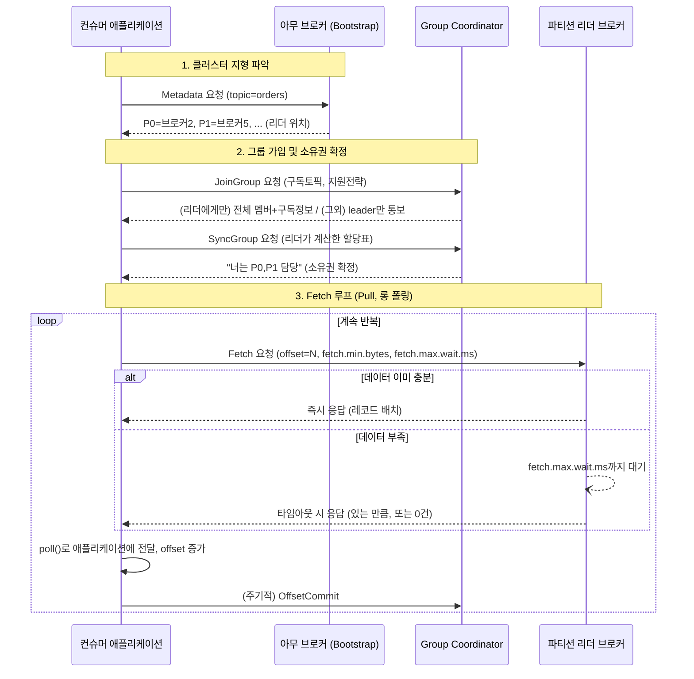

# 파티션 리더 위치는 어떻게 알아내는가 - Metadata 프로토콜과 Fetch 시퀀스

[[컨슈머는 브로커에서 메시지를 어떻게 가져올까 - Pull 기반 Fetch]]에서 컨슈머가 자신이 담당하는 파티션의 **리더 리플리카**에게 Fetch 요청을 보낸다고 했는데, "그 리더가 어느 브로커인지 컨슈머가 어떻게 아는가"는 별개의 질문이다. 처음엔 이걸 JoinGroup/SyncGroup에서 받는 정보로 착각하기 쉬운데, 실제로는 완전히 다른 프로토콜이다.

## 소유권과 위치는 서로 다른 정보다

| 정보 | 어디서 받는가 |
|---|---|
| "나는 어떤 파티션을 담당하는가" (소유권) | JoinGroup/SyncGroup ([[파티션 소유권과 리밸런싱의 관계]] 참고) — 그룹 코디네이터가 관리 |
| "그 파티션의 리더는 어느 브로커인가" (위치) | Metadata 요청/응답 — 클러스터의 아무 브로커나 응답 가능 |

컨슈머는 시작할 때 `bootstrap.servers`에 적힌 브로커 아무한테나 접속해서 Metadata 요청을 보낸다. 브로커들은 컨트롤러가 `LeaderAndIsr`/`UpdateMetadata`로 전파해준 덕분에 전체 클러스터 토폴로지(어떤 파티션의 리더가 어느 브로커인지)를 서로 캐싱하고 있어서, 접속한 브로커가 그 파티션의 리더가 아니어도 위치 정보를 답해줄 수 있다.

이 메타데이터는 `metadata.max.age.ms`(기본 5분)마다 갱신되고, 그보다 중요한 건 **리더가 바뀌었을 때 즉시 갱신**된다는 점이다. Fetch 요청을 보냈는데 그 브로커가 더 이상 리더가 아니면 `NOT_LEADER_OR_FOLLOWER` 에러가 오고, 컨슈머는 이걸 신호로 즉시 Metadata를 새로 받아온다.

컨슈머는 두 정보(소유권 + 위치)를 결합해서 "P0는 브로커2에게, P1은 브로커5에게 Fetch 요청을 보내야겠다"를 계산한다.

## 전체 흐름 시퀀스 다이어그램

1번(Metadata)과 2번(JoinGroup/SyncGroup)은 완전히 다른 프로토콜이고, 둘 다 끝난 뒤에야 3번(Fetch 루프)이 돈다. 1번은 "어디로 보낼지", 2번은 "뭘 요청할 자격이 있는지"를 정하고, 3번이 실제 메시지 소비다.

## Fetch 설정은 어디에 있는가 - 컨슈머가 정하고 브로커가 실행한다

절반은 맞고 절반은 아니다. **설정값 자체는 컨슈머(클라이언트) 쪽에 있고, 그 값을 근거로 "언제 응답할지" 판단하는 동작은 브로커 쪽에서 일어난다.**

| 설정 | 어디서 설정하는가 | 누가 그 값을 근거로 동작하는가 |
|---|---|---|
| `fetch.min.bytes` | 컨슈머 클라이언트 설정 | 브로커가 이 값을 Fetch 요청 안에서 전달받아, 응답을 보낼지 말지 판단 |
| `fetch.max.wait.ms` | 컨슈머 클라이언트 설정 | 브로커가 이 시간만큼 응답을 들고 대기 |
| `fetch.max.bytes` / `max.partition.fetch.bytes` | 컨슈머 클라이언트 설정 | 브로커가 응답 크기를 이 한도 내로 제한 |
| `max.poll.records` | 컨슈머 클라이언트 설정 | 순수 클라이언트 로컬 동작 (네트워크 요청과 무관, poll() 반환량만 제한) |

컨슈머가 "나는 이런 조건으로 기다려줘"라고 요청에 담아 보내고, 그 요청을 받은 브로커가 그 조건대로 동작(대기하거나 즉시 응답)하는 구조다. 설정의 주인은 클라이언트지만 실행은 브로커에서 일어난다. 브로커 자체도 별도의 상한선(`socket.request.max.bytes` 등)을 갖고 있어서, 클라이언트가 요청한 값이 브로커의 허용 범위를 넘으면 브로커 쪽 제한이 우선한다.

## 참고 자료

- [Confluent — Inside the Kafka Black Box 4: Understanding Consumer Fetch Requests](https://www.confluent.io/blog/kafka-producer-and-consumer-internals-4-consumer-fetch-requests/) — Fetch 요청 내부 동작을 가장 자세히 다루는 글
- [Confluent Developer — Consumer Group Protocol (Hands On)](https://developer.confluent.io/courses/architecture/consumer-group-protocol-hands-on/) — JoinGroup/SyncGroup 흐름을 실습과 함께 설명
- [Confluent — Apache Kafka Data Access Semantics: Consumers and Membership](https://www.confluent.io/blog/apache-kafka-data-access-semantics-consumers-and-membership/) — 컨슈머 그룹 프로토콜 개념 설명
- [Apache Kafka 공식 Protocol Guide](https://kafka.apache.org/protocol.html) — Fetch/Metadata/JoinGroup/SyncGroup 요청·응답의 실제 필드 스펙 (1차 자료)
- [Adobe Tech Blog — Exploring Kafka Consumer's Internals](https://blog.developer.adobe.com/exploring-kafka-consumers-internals-b0b9becaa106) — 컨슈머 클라이언트 내부(프리페치 등) 관점의 설명

## 한 줄 정리
> 파티션 소유권(JoinGroup/SyncGroup)과 파티션 위치(Metadata 요청)는 서로 다른 프로토콜이며, 컨슈머는 이 둘을 합쳐서 리더 브로커에 Fetch 요청을 보낸다. fetch.min.bytes/fetch.max.wait.ms 같은 설정은 컨슈머가 정하지만, 그 값을 근거로 응답을 지연시키거나 즉시 보내는 실행은 브로커 쪽에서 일어난다.
