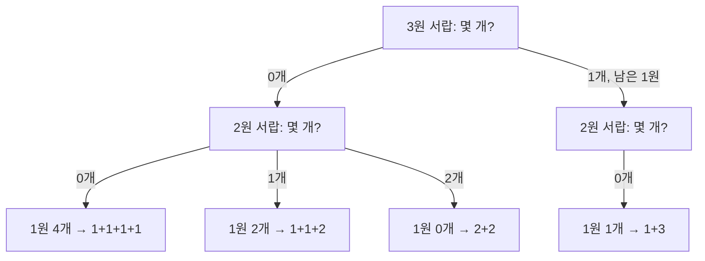

# The Coin Change Problem: "몇 번째에 뭘 낼까"가 아니라 "몇 개 낼까"로 세기

경우의 수 DP는 루프 순서 하나로 **조합**을 세는지 **순열**을 세는지가 갈린다. 코드는 똑같이 생겼는데 답은 다르게 나와서 헷갈리기 쉬운 문제다.

- 문제: [HackerRank - The Coin Change Problem](https://www.hackerrank.com/challenges/coin-change/problem) (같은 유형: LeetCode 518. Coin Change II)
- 단계별로 눌러 보는 시각자료: [[coin-change-stepper.html]] (브라우저로 열기)

## 문제 요약

동전 종류 `c`를 개수 제한 없이 써서 금액 `n`을 만드는 **방법의 수**를 구한다. 동전 순서만 다른 건 같은 방법으로 친다.

```
n = 4, c = {1, 2, 3}
{1,1,1,1}, {1,1,2}, {2,2}, {1,3}  →  4
```

## 접근: 서랍을 하나씩 열면서 "이 동전을 몇 개 낼까?"만 정한다

**틀리게 세는 방법**은 "첫 번째에 뭘 내고, 두 번째에 뭘 낼까?"처럼 순서대로 세는 거다.

```
1원 → 1원 → 2원 ┐
1원 → 2원 → 1원 ├─ 셋 다 "1원 2개 + 2원 1개"인데 3번 셈
2원 → 1원 → 1원 ┘
```

`dp[4] = dp[3] + dp[2] + dp[1]`로 계산하면 이렇게 되고, 답이 **7**이 나온다.

**맞게 세는 방법**은 지갑의 동전 서랍을 하나씩 차례로 열면서 **"이 동전을 몇 개 낼까?"만** 정하는 거다. 한 번 닫은 서랍은 다시 열지 않는다.



순서를 정하는 단계가 없으니까 조합 하나가 딱 한 번만 세진다. → **4** ✅

같은 얘기를 "이 동전을 쓰나, 안 쓰나?"로 나눠 볼 수도 있다.

```
{1,2,3}으로 4 만들기 = 3을 안 씀({1,2}로 4 만들기: 3가지)
                     + 3을 씀(3 하나 내고 {1,2,3}으로 1 만들기: 1가지)  = 4
```

## 제출한 풀이

```java
public static long getWays(int n, List<Long> c) {
    long[] dp = new long[n + 1];          // dp[i] = 금액 i를 만드는 조합 수
    dp[0] = 1;                            // 0원: 아무것도 안 내는 1가지

    for (long coinL : c) {                // 바깥 = 동전 (서랍을 하나씩 연다)
        int coin = (int) coinL;
        for (int i = coin; i <= n; i++) { // 안쪽 = 금액, 오름차순
            dp[i] += dp[i - coin];        // 안 쓰는 방법(기존 값) + 이 동전을 하나 더 붙이는 방법
        }
    }
    return dp[n];
}
```

## 핵심 포인트

**1. `dp[i] += dp[i - coin]`은 "왼쪽 칸의 방법마다 이 동전을 하나 붙인다"는 뜻이다.**

dp 칸 안에 숫자 대신 실제 조합을 넣어 보면 한눈에 보인다.

| 단계 | 0원 | 1원 | 2원 | 3원 | 4원 |
|---|---|---|---|---|---|
| 초기 | 빈손 **(1)** | (0) | (0) | (0) | (0) |
| 1원 서랍 | 빈손 **(1)** | `1` **(1)** | `1 1` **(1)** | `1 1 1` **(1)** | `1 1 1 1` **(1)** |
| 2원 서랍 | 빈손 **(1)** | `1` **(1)** | `1 1` / `2` **(2)** | `1 1 1` / `1 2` **(2)** | `1 1 1 1` / `1 1 2` / `2 2` **(3)** |
| 3원 서랍 | 빈손 **(1)** | `1` **(1)** | `1 1` / `2` **(2)** | `1 1 1` / `1 2` / `3` **(3)** | `1 1 1 1` / `1 1 2` / `2 2` / `1 3` **(4)** |

표에 나온 모든 조합은 동전이 **1 → 2 → 3 순서로만** 놓여 있다. `2 1 1` 같은 모양은 한 번도 생기지 않는다. 동전을 바깥 루프에 둬서 "작은 서랍부터 차례로" 규칙이 저절로 지켜지기 때문이다.

그래서 `dp[4] = dp[3] + dp[2] + dp[1]` **모양 자체는 맞다.** 다만 각 항이 서로 다른 동전 집합 기준의 값이다.

```
dp[4] = dp{1}[3] + dp{1,2}[2] + dp{1,2,3}[1]
      =    1     +     2      +      1        = 4
```

**2. 금액 루프가 오름차순이어야 같은 동전을 여러 번 쓸 수 있다.**

2원 서랍 단계에서 4원 칸을 채울 때 가져오는 2원 칸에는 **방금 같은 단계에서 만든 `2`**가 이미 들어 있다. 여기에 2를 붙여서 `2 2`가 만들어진다. 금액 루프를 내림차순으로 돌면 이 값이 아직 없어서 동전을 한 개씩만 쓰는 0/1 배낭이 된다.

**3. 동전은 정렬할 필요 없다.**

"작은 것부터"는 설명용이었고, 실제로 중요한 건 **정해진 순서를 끝까지 지키는 것**이다. `{3,1,2}` 순서로 돌려도 조합은 "3들 → 1들 → 2들" 모양 하나로만 쓰이니까 답이 같다.

```
{3,1,2}: 초기 [1,0,0,0,0] → 3원 [1,0,0,1,0] → 1원 [1,1,1,2,2] → 2원 [1,1,2,3,4]  → 4 ✅
```

## 주의할 점 / 흔한 실수

| 실수 | 결과 |
|---|---|
| 바깥 루프를 금액, 안쪽 루프를 동전으로 돌림 | 순열을 세서 7이 나옴 |
| 금액 루프를 `n`부터 거꾸로 돌림 | 동전을 한 번씩만 쓰게 됨 (0/1 배낭) |
| `int[] dp` 사용 | 경우의 수가 커서 오버플로 (n=250, 동전 26종이면 약 3.5×10⁹) |
| `dp[0] = 1` 빠뜨림 | 전부 0 |

- 엣지 케이스: `n = 0`이면 1. 모든 동전이 `n`보다 크면 0 (안쪽 루프가 한 번도 안 돎)
- 최소 동전 개수(LeetCode 322)와 헷갈리지 말 것: 그쪽은 `dp[i] = min(dp[i], dp[i-c] + 1)`에 초기값이 "불가능 = 큰 값"이고, 이 문제는 `+=`로 **합**을 구하고 초기값이 `dp[0] = 1`이다.
- 복잡도: 시간 O(n × m), 공간 O(n)

## 한 줄 정리

> 동전을 바깥 루프에 두면 "몇 번째에 뭘 낼까"가 아니라 **"동전마다 몇 개 낼까"**를 세게 되고, 그래서 조합이 한 번씩만 세진다. 금액을 오름차순으로 돌기 때문에 같은 동전을 여러 번 쓸 수 있다.
